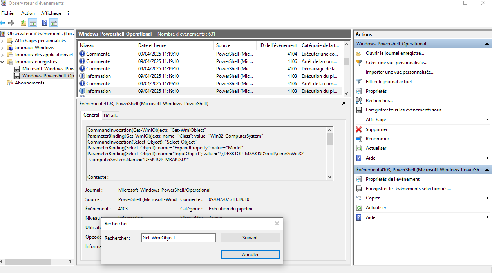
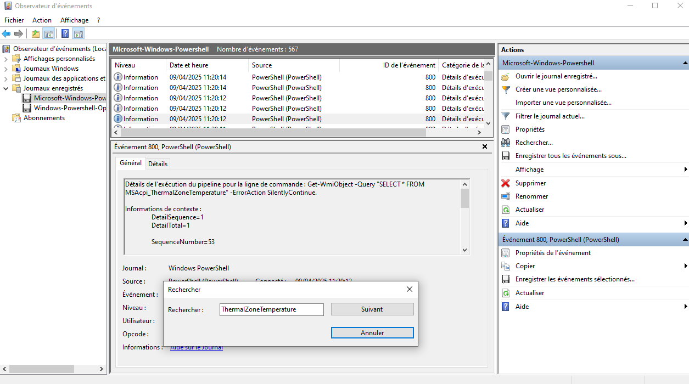
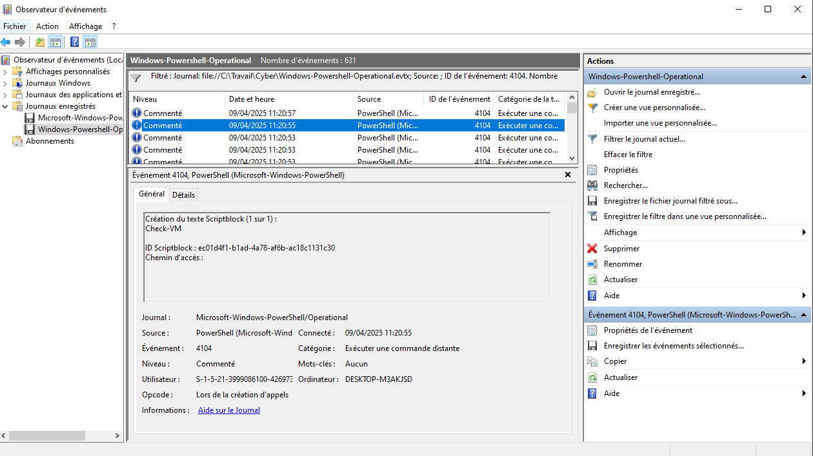
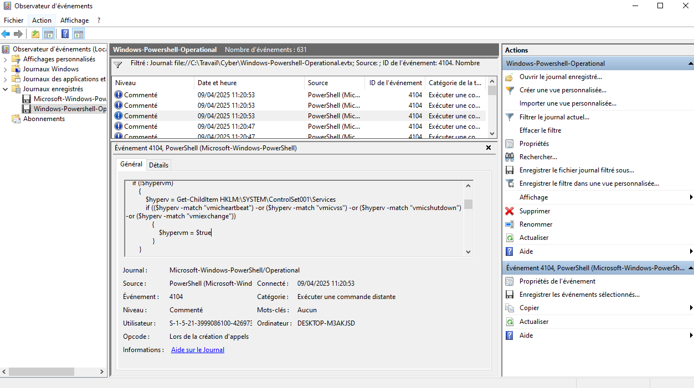
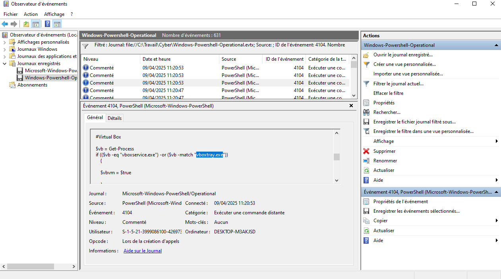
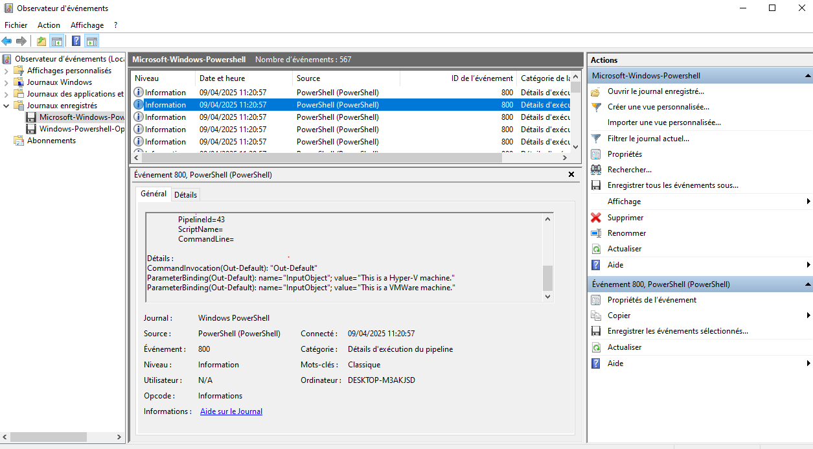

# HackTheBox - Operation Blackout CTF Writeup

## Overview

This writeup covers the analysis of EVTX (Windows Event Log) files provided as part of the Operation Blackout challenge. The investigation focuses on identifying various WMI queries and PowerShell activities performed by an attacker, including system reconnaissance and virtualization detection techniques.

## Challenge Analysis

### Task 1: Identifying WMI Class for System Information Retrieval

The first objective was to determine which WMI class the attacker utilized to retrieve model and manufacturer information from the target system.

After conducting research on WMI class identification methods, I discovered the appropriate function through Microsoft's official documentation:

**Reference:** [Get-WmiObject PowerShell Module Documentation](https://learn.microsoft.com/en-us/powershell/module/microsoft.powershell.management/get-wmiobject?view=powershell-5.1)

Through analysis of the event logs, the WMI class used by the attacker was identified as:

**Answer:** `Win32_ComputerSystem`

This class provides comprehensive system information including manufacturer details, model specifications, and other hardware-related data.



### Task 2: Temperature Monitoring WMI Query

The next challenge involved identifying which WMI query the attacker executed to retrieve the current temperature of the machine.

Research into CPU temperature monitoring via command line and PowerShell led me to a relevant Stack Overflow discussion:

**Reference:** [Get CPU Temperature in CMD/PowerShell](https://stackoverflow.com/questions/39738494/get-cpu-temperature-in-cmd-power-shell)

The analysis revealed that the attacker used the following WMI class:

**Answer:** `MSAcpi_ThermalZoneTemperature`

This class enables retrieval of thermal zone temperature data from the system. The event logs showed that the attacker executed a SELECT * query against this temperature monitoring class to gather thermal information from the compromised machine.



### Task 3: PowerShell Virtualization Detection Script

The investigation then focused on a PowerShell script loaded by the attacker for virtualization detection purposes. Analysis of the Microsoft-Windows-PowerShell event logs revealed evidence of remote execution activities.

By filtering events based on Event ID and examining the PowerShell execution logs, I was able to identify the relevant function name within the captured events. The logs contained detailed information about the script's execution and its various detection mechanisms.



### Task 4: Registry Service Details Analysis

Further examination of Event ID 4104 logs revealed additional details about the `Check-VM` function. The analysis showed that this script component retrieves service information from the following registry location:

**Registry Path:** `HKLM:\SYSTEM\ControlSet001\Services`

This registry path contains critical service configuration data that the virtualization detection script leverages to identify the underlying platform.



### Task 5: VirtualBox Process Detection

The challenge required identification of which processes the script compares to determine if the system is running VirtualBox.

Within the same `Check-VM` function, the VirtualBox comparison logic was clearly visible. The script performs process detection by comparing against the following executables:

**Answer:** `vboxservice.exe`, `vboxtray.exe`

These processes are characteristic of VirtualBox installations and serve as reliable indicators for virtualization detection.



### Task 6: Detected Virtualization Platforms

The final task involved identifying which two virtualization platforms the script successfully detected during execution.

By examining the Microsoft-Windows-PowerShell event logs, I located the script's output messages that clearly indicated the detection results:

The parameter binding outputs revealed:

```
ParameterBinding(Out-Default): name="InputObject"; value="This is a Hyper-V machine."
ParameterBinding(Out-Default): name="InputObject"; value="This is a VMWare machine."
```

**Answer:** The script detected both **Hyper-V** and **VMware** virtualization platforms.



This comprehensive analysis showcases the multi-layered approach used by the attacker for system reconnaissance and environmental detection.