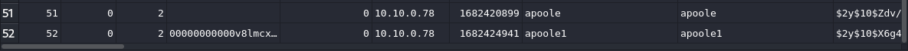
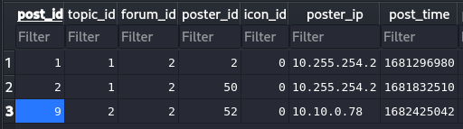
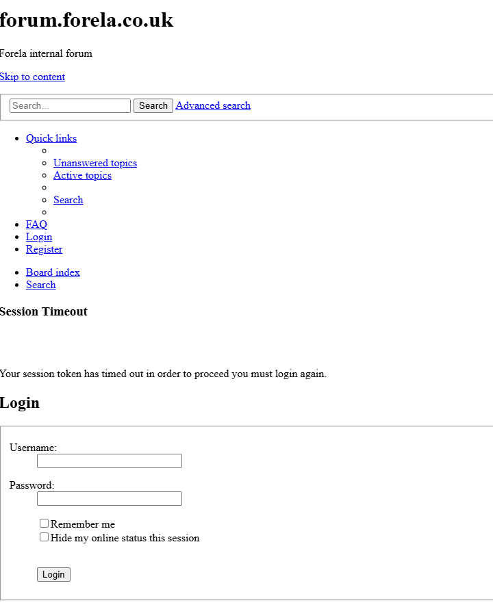
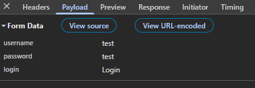
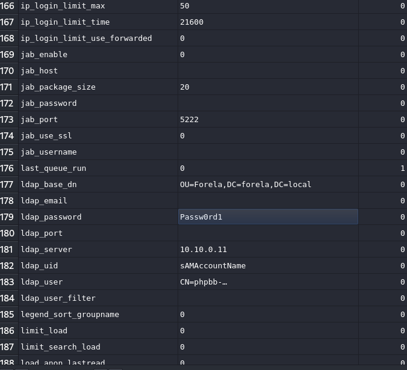
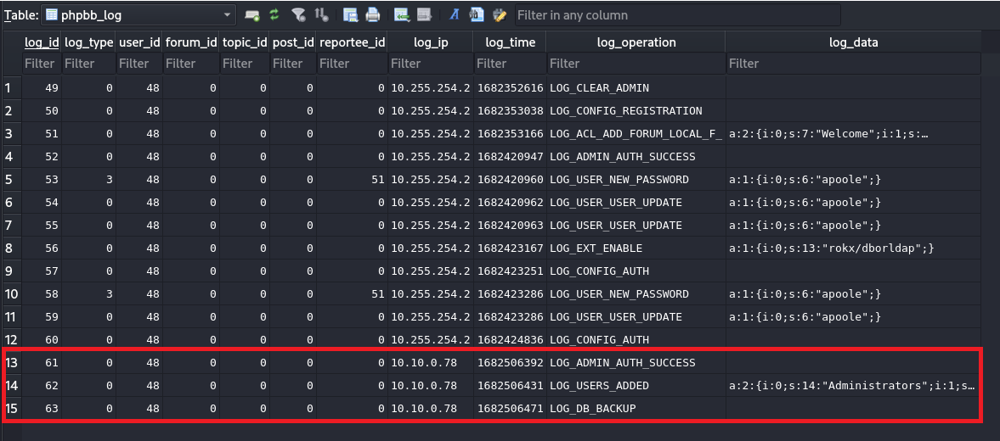
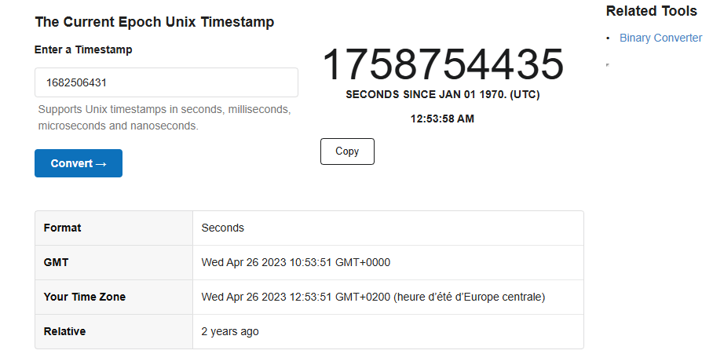

## Challenge Overview

An external contractor has successfully accessed the internal forum at Forela via the Guest Wi-Fi network. During this unauthorized access, the attacker managed to steal credentials belonging to the administrative user. This investigation focuses on analyzing the provided logs and database dump to reconstruct the attack timeline and identify the techniques used by the threat actor.

## Initial Evidence

For this investigation, we were provided with two critical files:

1. `access.log` - Web server access logs from the phpBB forum
2. `phpbb.sqlite3` - Complete database dump in SQLite3 format

The primary objective is to leverage the database contents in conjunction with the access logs to identify the external contractor responsible for this security incident.

## Investigation Process

### Phase 1: Identifying the Attacker

By analyzing the database records and correlating them with the access logs, we can identify the username of the external contractor. The access logs reveal suspicious activity originating from IP address `10.10.0.78`:



```
10.10.0.78 - - [25/Apr/2023:12:07:42 +0100] "GET /ucp.php?mode=register&sid=a6ef84d1dbe44514d987667afd8cf504 HTTP/1.1" 200 3957 "http://10.10.0.27/" "Mozilla/5.0 (Windows NT 10.0; Win64; x64; rv:106.0) Gecko/20100101 Firefox/106.0"

10.10.0.78 - - [25/Apr/2023:12:07:42 +0100] "GET /cron.php?cron_type=cron.task.core.prune_notifications&sid=a6ef84d1dbe44514d987667afd8cf504 HTTP/1.1" 200 256 "http://10.10.0.27/ucp.php?mode=register&sid=a6ef84d1dbe44514d987667afd8cf504" "Mozilla/5.0 (Windows NT 10.0; Win64; x64; rv:106.0) Gecko/20100101 Firefox/106.0"
```

These log entries show the attacker registering a new account on the forum and subsequently accessing various forum functionalities.

### Phase 2: Discovering the Malicious Post

Further investigation into the database reveals that this user created a potentially malicious post on the forum. We can locate the specific post by querying the database using either the poster's user ID or their IP address (`10.10.0.78`).



Upon examining the post content, several concerning elements become apparent:

**Attack Technique: Phishing via Fake Login Screen**

The attacker crafted a sophisticated social engineering attack by posting a replica of the forum's login screen with a fake session timeout message. This deceptive post was designed to trick legitimate users into believing their session had expired and that they needed to re-authenticate.



**Credential Harvesting Mechanism**

When an unsuspecting user enters their username and password into this fraudulent login form and clicks the login button, the credentials are transmitted directly to the attacker's IP address as URL parameters in the request payload. Through this phishing technique, the attacker successfully deceived the administrator into submitting their credentials, thereby gaining unauthorized access to the administrative account.



### Phase 3: Post-Compromise Activity

After obtaining the administrative credentials, the attacker successfully authenticated to the forum using the stolen admin account. This elevated access allowed them to perform various malicious actions within the system.

### Phase 4: Database Configuration Analysis

Diving deeper into the database structure, we examined the `phpbb_config` table, which contains numerous configuration settings for the forum installation. Several noteworthy findings include:

- **Allowed protocols**: The forum configuration permits HTTP, HTTPS, and FTP links, which presents security concerns due to the inclusion of unencrypted protocols
- **Board email configuration**: Administrative email settings are stored in this table
- **LDAP credentials**: Critically, the password for the LDAP connection is stored within this configuration table, representing a significant security exposure



### Phase 5: Privilege Escalation Timeline

Within the same database, a separate table logs all data modifications made to the system. This audit log captures the attacker's privilege escalation activities, specifically recording when they authenticated as the administrator and subsequently added their own account to the administrators group.



Each log entry includes a Unix timestamp, which can be converted to UTC/GMT time format using online conversion tools such as https://www.unixtimestamp.com/. This timestamp correlation allows us to establish a precise timeline of the attack progression.



### Phase 6: Data Exfiltration

The final stage of the attack involved data exfiltration. Analysis of the access logs reveals that the attacker downloaded a database backup file:

```
10.10.0.78 - - [26/Apr/2023:12:01:38 +0100] "GET /store/backup_1682506471_dcsr71p7fyijoyq8.sql.gz HTTP/1.1" 200 34707
```

The backup file `backup_1682506471_dcsr71p7fyijoyq8.sql.gz` was successfully retrieved, with a file size of 34,707 bytes. This compressed SQL dump likely contains sensitive information including user credentials, forum content, and configuration data.

