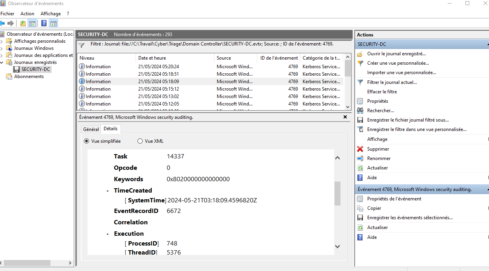
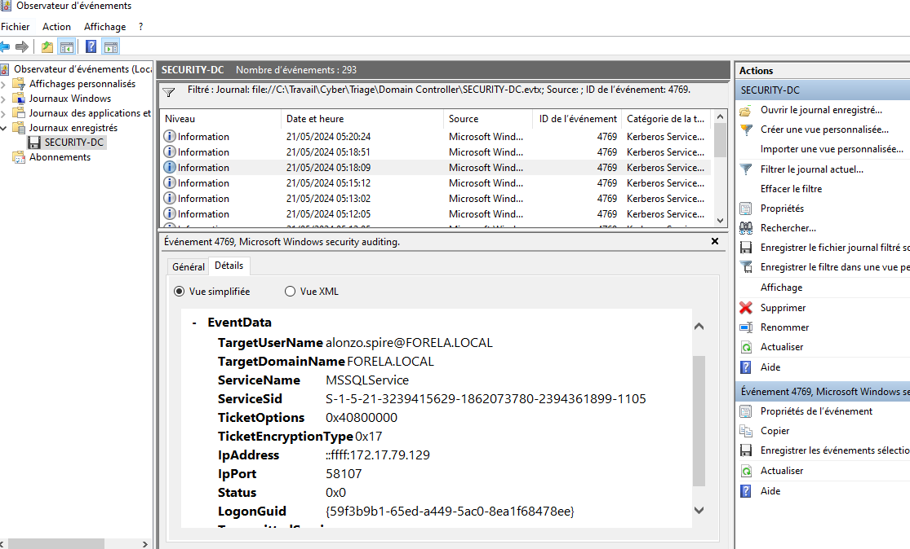
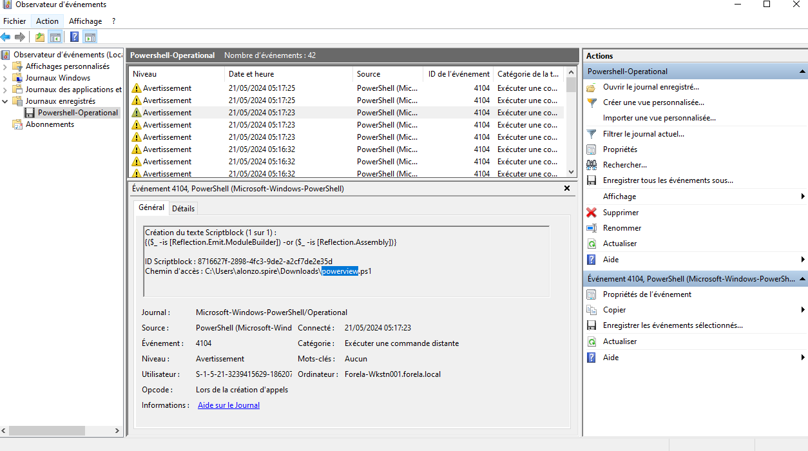
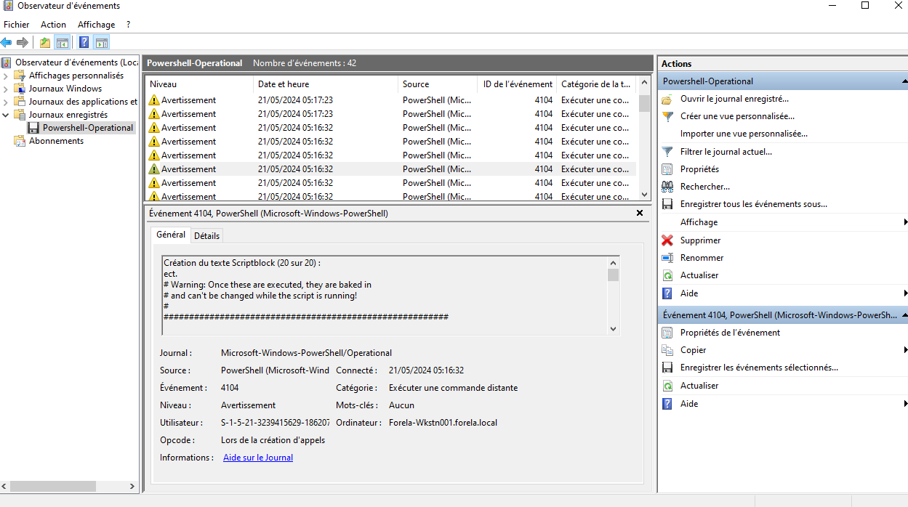
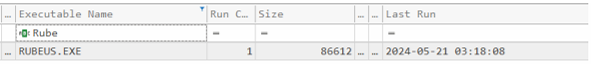
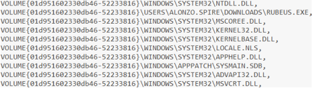

# Campfire CTF - Kerberoasting Attack Analysis

## Synopsis

Alonzo Spotted identified unusual files on his computer and promptly informed the newly assembled Security Operations Center (SOC) Team. Upon initial assessment of the situation, the security team determined that a Kerberoasting attack may have occurred within the network infrastructure. 

This writeup documents the digital forensics investigation process to confirm these findings through comprehensive analysis of the provided evidence artifacts.

## Evidence Artifacts

The investigation was conducted using three primary sources of evidence:

1. **Security Logs from the Domain Controller**
2. **PowerShell-Operational Logs from the affected workstation**
3. **Prefetch Files from the affected workstation**

## Investigation Methodology

### Phase 1: Identifying the Kerberoasting Attack Timeline

To establish the date and time of the suspected Kerberoasting attack, we filtered the Windows Security Event Logs for Event ID 4769, which specifically corresponds to Kerberos service ticket requests that are characteristic of Kerberoasting attacks.

Through analysis of the Security Event Logs, we successfully extracted critical information including:
- **Timestamp**: The exact date and time when the Kerberoasting attack occurred
- **Target Service**: The specific service name that was targeted during the attack
- **Source Location**: The IP address of the workstation from which the attack originated





### Phase 2: PowerShell Operational Log Analysis

After establishing the timeline and location of the Kerberoasting activity, we proceeded to examine the PowerShell-Operational event logs from the compromised workstation. The analysis immediately revealed multiple instances of Event ID 4104, which indicates "Execute a Remote Command" activities.

*Reference: [MyEventLog.com Event ID 4104 Documentation](https://www.myeventlog.com/search/show/980)*

During the detailed examination of the PowerShell event logs, we discovered a critical finding: one event log entry documented the creation of a script block with the file path `C:\Users\alonzo.spire\Downloads\powerview.ps1`. This evidence strongly suggests that the attacker executed this PowerView script as part of their attack methodology.



### Phase 3: Script Execution Timeline

Further investigation of the PowerShell event logs revealed the final script block creation event, which contained the following distinctive message:

```
# Warning: Once these are executed, they are baked in
# and can't be changed while the script is running!
```

This message marker indicated the actual execution of the malicious script, which occurred precisely at **2024-05-21 03:16:32**.



### Phase 4: Prefetch Analysis Using Eric Zimmerman's Tools

To identify the specific tools utilized by the attacker, we employed Eric Zimmerman's PECmd tool for comprehensive prefetch artifact analysis. The following command was executed to generate a detailed CSV report of all prefetch artifacts:

```bash
Pecmd.exe -d "Path of prefetchArtifacts" --csv . --csvf result.csv
```

This command generated a comprehensive CSV file containing detailed information about all prefetch artifacts present in the specified directory.

### Phase 5: Attack Tool Identification

Upon analyzing the executables that ran on 2024-05-21, we identified a suspicious tool that was executed exactly one second before our Domain Controller logged the malicious Kerberoasting event. This timing correlation provided strong evidence of the attack tool used.

By examining the files loaded by Windows and tracing the full execution path, we determined the complete file path of the attack tool.

**Primary Attack Tool**: `Rubeus.exe`  



**Full Path**: `C:\Users\Alonzo.spire\Downloads\Rubeus.exe`



## Conclusion

The digital forensics investigation successfully confirmed the occurrence of a Kerberoasting attack within the network. The evidence clearly demonstrates that an attacker utilized Rubeus.exe for the Kerberoasting attack and PowerView.ps1 for network reconnaissance activities. The precise timing correlation between the tool execution and the Domain Controller security events provides definitive proof of the attack methodology and timeline.

This investigation highlights the importance of comprehensive log analysis across multiple data sources and demonstrates the effectiveness of combining Windows Security Logs, PowerShell Operational Logs, and prefetch artifacts for incident response and digital forensics investigations.