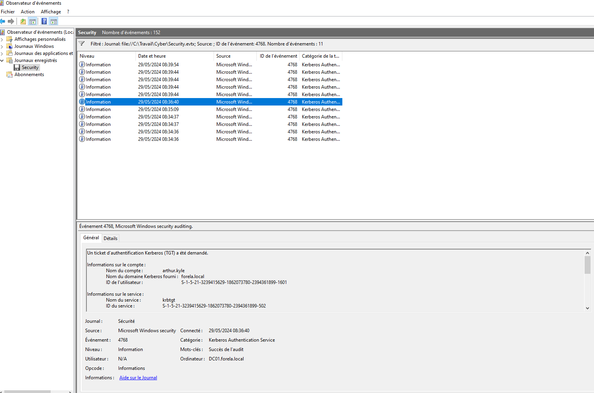
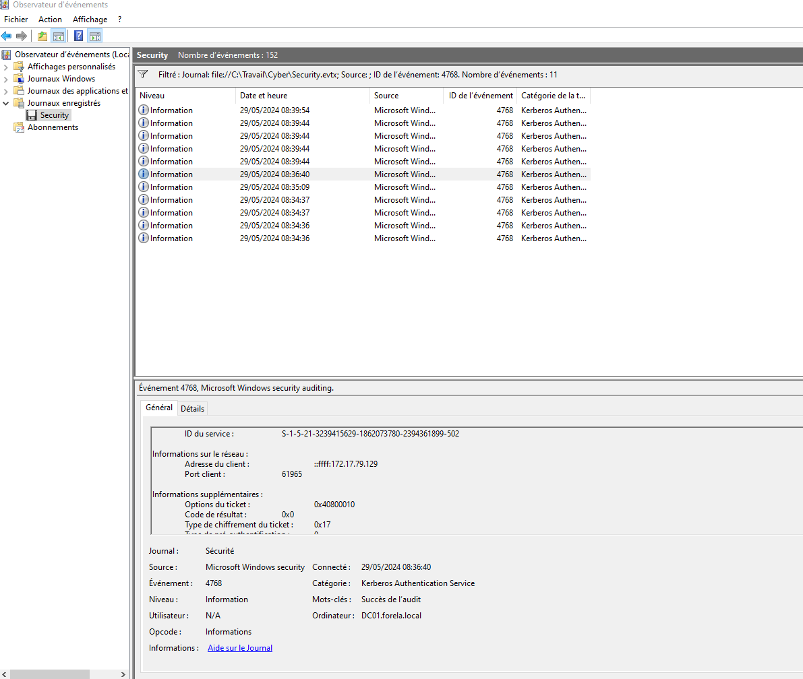
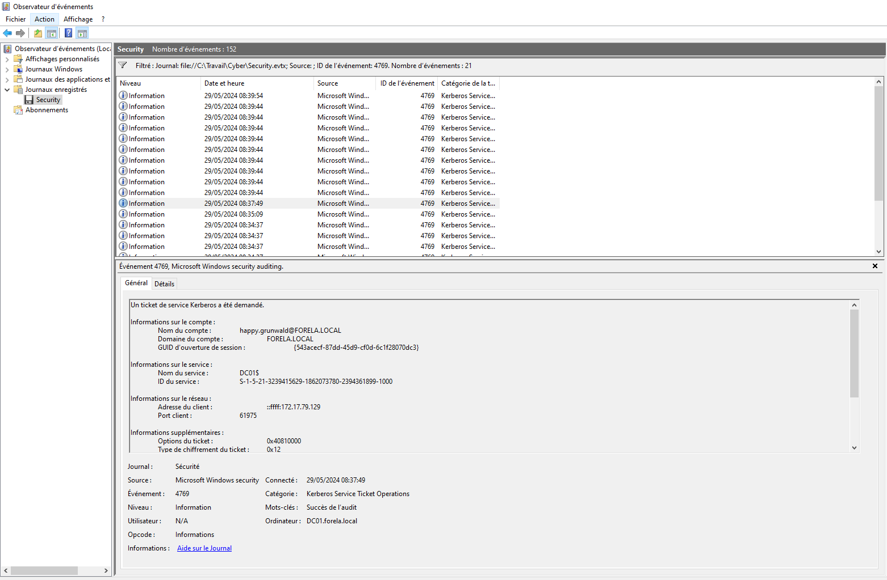

# CampFire2 CTF Writeup - ASREPRoasting Attack Analysis

## Challenge Synopsis

Forela's Network is constantly under attack, presenting a critical security incident that requires immediate investigation. The security system has raised an alert concerning an old administrative account that has requested a ticket from the Key Distribution Center (KDC) on a domain controller. According to the current inventory records, this particular user account is not actively used at this time, making this activity highly suspicious and warranting thorough investigation.

This incident has been flagged as a potential ASREPRoasting attack, a technique where attackers can request any user's ticket when that user has Kerberos preauthentication disabled. ASREPRoasting is a dangerous attack vector that allows adversaries to obtain encrypted tickets offline and attempt to crack them using brute-force methods.

## Investigation Approach

The challenge provides us with only one EVTX file containing Windows event logs. Our entire investigation and analysis must be conducted using the information contained within this single log file, making efficient filtering and correlation of events crucial for successful resolution.

## Step 1: Initial Event Analysis - Kerberos Authentication Discovery

For the first phase of our investigation, we focused on filtering events by Kerberos authentication activities using Event ID 4768, which corresponds to "A Kerberos authentication ticket (TGT) was requested" events. This event ID is particularly valuable as it captures initial authentication attempts that could indicate unauthorized access.

After examining all possible logs with this event ID, we successfully identified one specific Kerberos authentication event that stood out from the normal administrative and workstation account activities. The account name discovered in this event appeared to be associated with a legitimate user account rather than standard administrative or system accounts, making it a prime candidate for further investigation.

### Key Findings from Event ID 4768:

- **Timestamp (UTC):** 2024-05-29 06:36:40
- **Suspicious Account Activity:** User account authentication outside normal patterns
- **Event Context:** Kerberos TGT request from potentially compromised account

## Step 2: Target Account Identification

Through careful analysis of the same authentication log, we were able to extract critical information about the targeted account. The investigation revealed both the account name and the associated Security Identifier (SID) of the account that was targeted by the attacker.

### Target Account Details:

- **Target SID:** S-1-5-21-3239415629-1862073780-2394361899-1601
- **Attack Vector:** ASREPRoasting targeting account with disabled preauthentication

## Understanding Security Identifiers (SIDs)

Security Identifiers play a crucial role in Windows security architecture and are essential for proper incident investigation. Each account or group possesses a unique SID that is issued by an authoritative source, such as a domain controller. These SIDs serve as immutable identifiers that remain consistent regardless of account name changes or other modifications.

SIDs can be associated with various entity types including:
- User accounts (individual users)
- Computer accounts (domain-joined machines)
- Security groups (collections of users or computers)
- Threads or processes running in specific security contexts

Additionally, the Windows security model includes well-known SIDs that identify generic groups and users across all Windows systems. For example, the "Everyone" group, which encompasses all users in the system, has a universally recognized SID. Microsoft maintains comprehensive documentation of these well-known SIDs, which can be referenced at: https://learn.microsoft.com/en-us/windows/win32/secauthz/well-known-sids

## Step 3: Compromised Asset Identification

A critical aspect of this investigation involves identifying the compromised user account. To identify the attacking account, we implemented a targeted filtering strategy focusing on Kerberos service ticket operations, specifically Event ID 4769, which corresponds to "A Kerberos service ticket was requested" events. We correlated this event type with our known attack parameters:

1. **Temporal Correlation:** Events occurring around 2024-05-29 06:36:40
2. **Network Correlation:** Activities originating from IP address 172.17.79.129
3. **Behavioral Correlation:** Service ticket requests following the initial authentication (event ID 4769)

### Final Discovery:

Through this methodical correlation of events, we successfully identified the user account that performed the ASREPRoasting attack.

**Attacker Account:** happy.grunwald

## Conclusion

This investigation successfully demonstrated the identification and analysis of an ASREPRoasting attack through systematic examination of Windows event logs. By correlating Kerberos authentication events (Event ID 4768) with subsequent service ticket requests (Event ID 4769), we were able to construct a complete attack timeline and identify all key components:

1. **Attack Type:** ASREPRoasting targeting accounts with disabled preauthentication
2. **Attack Timeline:** 2024-05-29 06:36:40 UTC
3. **Compromised Workstation:** 172.17.79.129
4. **Attacker Account:** happy.grunwald
5. **Target Account SID:** S-1-5-21-3239415629-1862073780-2394361899-1601

This case highlights the importance of proper event log analysis in incident response and the value of understanding Kerberos authentication mechanisms for detecting advanced persistent threats within Windows Active Directory environments.
