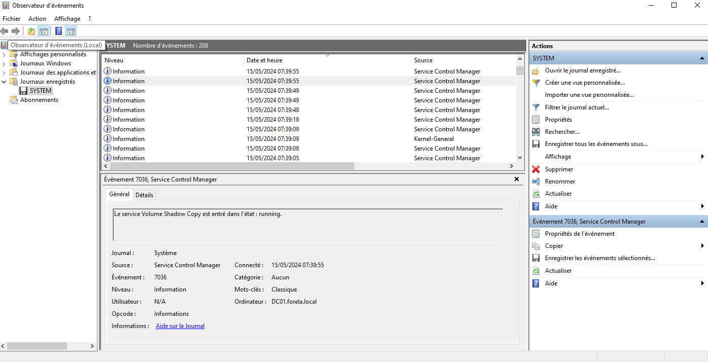
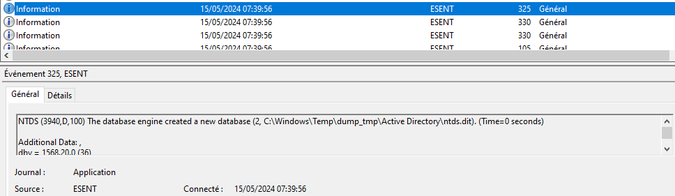
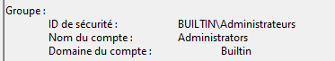
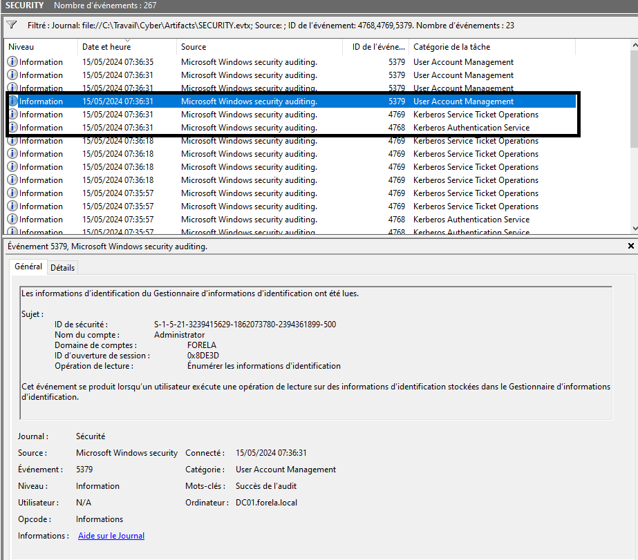

# Crown Jewels 2 CTF Challenge Writeup

## Scenario Overview

Forela's Domain environment is experiencing complete chaos. We have received another critical alert from the Domain Controller indicating that the NTDS.dit database is being exfiltrated once again. 

### Background Context

Just one day prior, we responded to an incident on the same Domain Controller where an attacker successfully dumped NTDS.dit using the `vssadmin` utility. During that incident response, we:
- Successfully identified and deleted the dumped files
- Kicked the attacker out of the Domain Controller
- Restored the system to a clean snapshot state

### Current Threat Situation

Despite our remediation efforts, the threat actor has regained access to the Domain Controller using a Domain Administrator account, indicating they have established persistent access within the environment. This time, they have changed their tactics and are abusing **ntdsutil** to dump the Active Directory database.

Our mission is to help Forela navigate these chaotic times by conducting a thorough forensic analysis to understand the full scope of this persistent compromise.

## Provided Artifacts

For this investigation, we were provided with three Windows Event Log (EVTX) files:

1. **APPLICATION.evtx** - Collects events from software applications running on the system
2. **SECURITY.evtx** - Collects Windows security-related events, including authentication and authorization modifications
3. **SYSTEM.evtx** - Collects events related to core system components and services

## Investigation Process

### Step 1: Understanding the Attack Vector

Since this incident involves NTDS.dit exfiltration (the Active Directory database), our investigation focuses primarily on system-level activities. The NTDS.dit file contains critical domain information including user credentials, making it a prime target for attackers.

### Step 2: Analyzing Volume Shadow Copy Service Activity

When `ntdsutil.exe` is utilized to dump NTDS.dit to disk, it simultaneously employs the **Microsoft Shadow Copy Service**. This is a critical indicator we can track in the event logs.

#### SYSTEM.evtx Analysis

We examined the `SYSTEM.evtx` file to identify Volume Shadow Copy Service activity. By locating the Shadow Copy Service events, we established a precise timestamp for when the NTDS dump operation occurred.

**Identified Timestamp**: **2024-05-15 05:39:55**

This timestamp became our temporal anchor point for correlating activities across all other event logs.

### Step 3: Locating the Dumped NTDS File Path

Using the timestamp identified from the Shadow Copy Service activity (**2024-05-15 05:39:55**), we pivoted to the `APPLICATION.evtx` file to search for related events occurring around this specific time.

#### APPLICATION.evtx Findings

Upon examination of the application logs near the established timestamp, we successfully identified the exact file path where the NTDS.dit database was dumped:

**Dump Location**: `C:\Windows\Temp\dump_tmp\Active Directory\ntds.dit`

### Step 4: ESENT Database Events Analysis

Within the application logs, we observed events from the **ESENT** event source. ESENT (Extensible Storage Engine) is Microsoft's database engine that provides crucial database status information, including:
- Database creation events
- Database attachment operations
- Database detachment operations

These ESENT events provided additional confirmation of database manipulation activities occurring during the dump operation, giving us deeper insight into the technical execution of the attack.

### Step 5: Privilege Enumeration Investigation

During the NTDS dump process, the `ntdsutil.exe` executable enumerates specific user groups to validate the privileges of the account being used for the operation. This enumeration activity leaves traces in the security event logs.

#### SECURITY.evtx Analysis

We analyzed the `SECURITY.evtx` file and identified the two security groups that were enumerated during the privilege validation process. These group enumeration events provided us with a critical piece of information: the **Session Opening ID**.

### Step 6: Tracking the Logon Session

Using the Session Opening ID obtained from the group enumeration events, we were able to trace back to the initial logon session that the attacker established on the Domain Controller.

#### Kerberos Authentication Events

We identified a sequence of Kerberos authentication events that revealed the complete authentication flow:

1. **Event ID 4768** - A Kerberos Authentication Ticket (TGT) was requested
   - This event showed the initial authentication request for the compromised account

2. **Event ID 4769** - A Kerberos Service Ticket was requested
   - This event immediately followed the 4768 event
   - Contained the same Subject Username as the previous event
   - Subsequent events in the chain contained the Logon ID we were tracking

This sequence of events allowed us to reconstruct the complete authentication and authorization chain used by the attacker to gain access and execute the NTDS dump operation.

