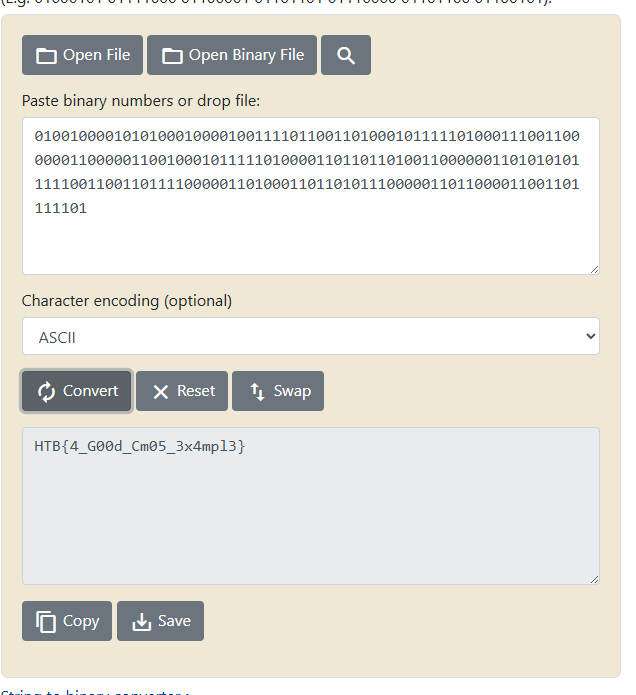

# Low Logic CTF Challenge Writeup

## Challenge Overview

For this challenge, we were provided with two key components:
- A circuit chip design
- A CSV file containing input data


Our objective was to determine the final output produced by the chip when processing the given inputs.

## Initial Analysis

Upon initial examination of the provided chip design, we identified that the circuit is constructed using NPN transistors and resistors. This configuration allowed us to recognize the underlying logic gate architecture.

## Circuit Architecture

Through careful analysis, we discovered that the chip contains three distinct logic gates:

### Two AND Gates
- **Gate 1**: `IN0 AND IN1 = OUT1`
- **Gate 2**: `IN2 AND IN3 = OUT2`

### One OR Gate
- **Gate 3**: `OUT1 OR OUT2 = FINAL_OUTPUT`

The circuit implements a compound logic operation where two pairs of inputs are first processed through AND gates, and their results are subsequently combined using an OR gate.

## Reference Materials

We utilized the following resource to understand the circuit design of NPN-based logic gates:
- [NPN/PNP Logic Gates](https://acastano.com/stem/computer-design/npn-pnp-logic-gates/)

This reference provided valuable insights into how these logic gates are constructed using transistors.

## Solution Implementation

### Approach

Given that our CSV file contains multiple rows, each with four input values, we developed a solution to process each row individually and calculate the corresponding output for each set of inputs.

### Python Implementation

We implemented the following Python script to automate the logic gate processing:

```python
import csv

def process_logic_gates_to_file(csv_file, output_file):
    results = []
    
    with open(csv_file, 'r') as file:
        csv_reader = csv.reader(file)
        next(csv_reader)  # Skip header row
        
        # Process each data row
        for row in csv_reader:
            in0 = int(row[0])
            in1 = int(row[1])
            in2 = int(row[2])
            in3 = int(row[3])
            
            output1 = in0 and in1  # in0 AND in1
            output2 = in2 and in3  # in2 AND in3
            final_output = output1 or output2  # output1 OR output2
            
            results.append([final_output])
    
    with open(output_file, 'w', newline='') as file:
        csv_writer = csv.writer(file)
        csv_writer.writerow(['final_output'])
        csv_writer.writerows(results)

if __name__ == "__main__":
    # Process the CSV file and save results
    process_logic_gates_to_file("input.csv", "output.csv")
```

### Script Functionality

The script performs the following operations:
1. Reads the input CSV file row by row
2. Extracts the four input values (IN0, IN1, IN2, IN3)
3. Computes the first AND gate output: `OUT1 = IN0 AND IN1`
4. Computes the second AND gate output: `OUT2 = IN2 AND IN3`
5. Computes the final OR gate output: `FINAL_OUTPUT = OUT1 OR OUT2`
6. Writes all results to an output CSV file

## Results

After executing the script, we obtained the following binary output:

```
010010000101010001000010011110110011010001011111010001110011000000110000011001000101111101000011011011010011000000110101010111110011001101111000001101000110110101110000011011000011001101111101
```

## Flag Extraction

To convert the binary output to a readable string, we used the following online tool:
- [Binary to String Converter](https://www.rapidtables.com/convert/number/binary-to-string.html)



The binary sequence successfully decoded to reveal the challenge flag.