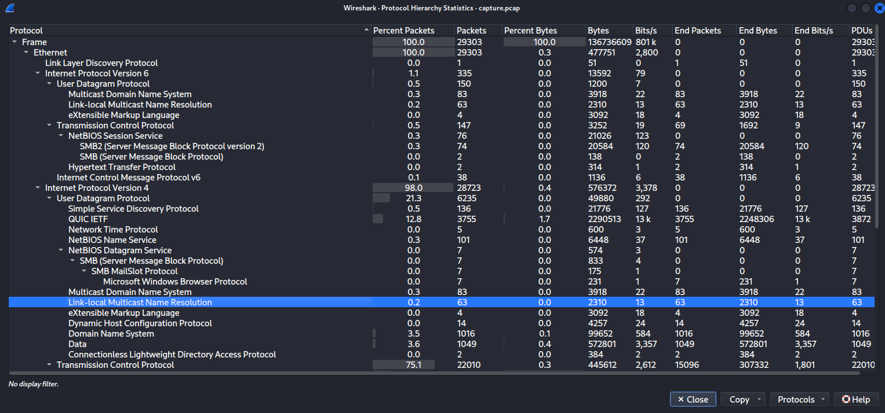
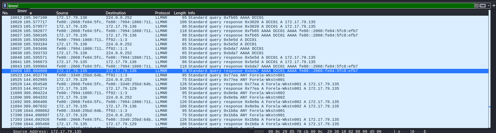
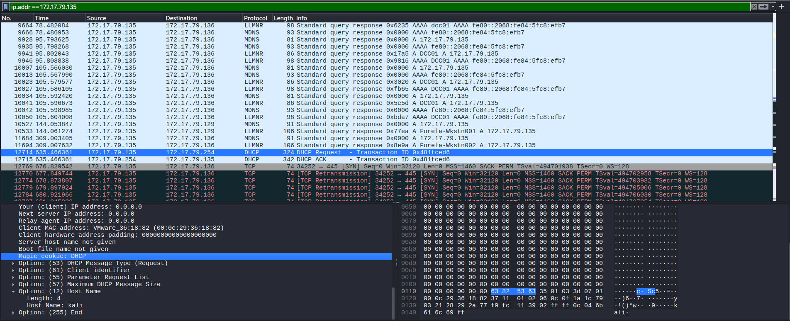
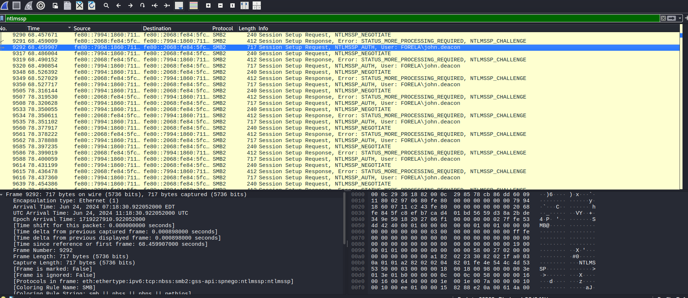
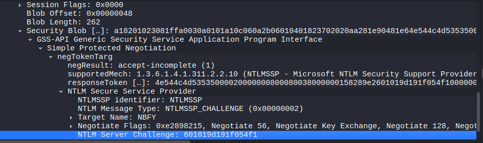
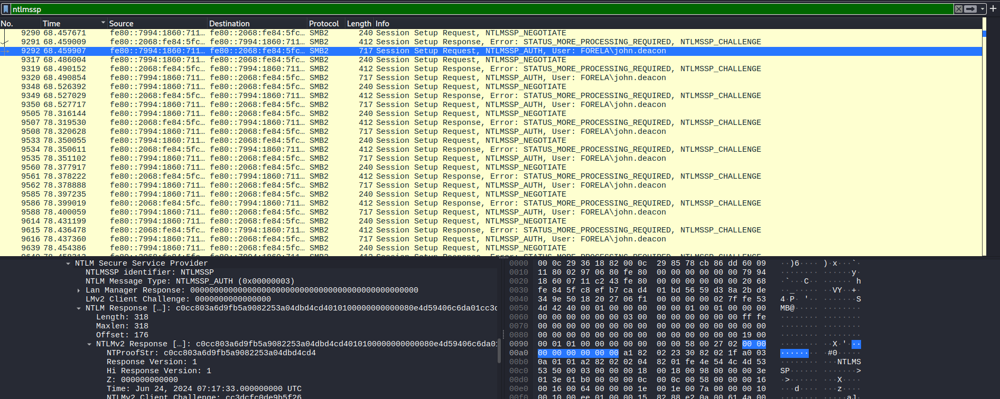
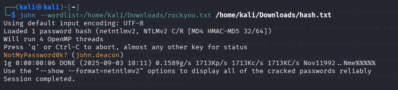

# HackTheBox - Noxious: LLMNR Poisoning Attack Analysis

## Challenge Synopsis

The Intrusion Detection System (IDS) has triggered an alert indicating the presence of a possible rogue device within our internal Active Directory network. The IDS specifically detected unusual Link-Local Multicast Name Resolution (LLMNR) traffic patterns, suggesting a potential LLMNR poisoning attack. The suspicious LLMNR traffic was directed towards **Forela-WKstn002** (IP address: 172.17.79.136), requiring immediate forensic analysis to determine the scope and impact of this security incident.

## LLMNR Protocol Overview

Link-Local Multicast Name Resolution (LLMNR) is a Microsoft protocol that allows hosts on the same local network to resolve each other's names when DNS resolution fails. LLMNR operates as a fallback mechanism when the primary DNS server cannot resolve a hostname query. This protocol is commonly exploited by attackers through poisoning attacks, where malicious actors respond to LLMNR queries pretending to be legitimate network resources.

## Network Traffic Analysis

### Initial LLMNR Traffic Assessment

Upon examining the network capture, we identified that LLMNR traffic constitutes approximately **0.2%** of the total network communications. While this percentage appears minimal, the presence of LLMNR traffic in a properly configured Active Directory environment is often indicative of potential security issues.



### LLMNR Protocol Filtering

To focus our investigation, we applied a filter for LLMNR protocol traffic to isolate the relevant communications. This filtering approach allows us to examine only the packets necessary for understanding the attack methodology.

### Attacker Identification

Through analysis of the LLMNR response patterns, we observed that Forela's services responded to queries originating from only one specific IP address. Given that **172.17.79.136** is confirmed as **Forela-WKstn002**, we can definitively identify **172.17.79.135** as the attacker's IP address based on the LLMNR communication patterns.



### Hostname Discovery via DHCP Analysis

To determine the attacker's hostname, we examined Dynamic Host Configuration Protocol (DHCP) traffic within the capture. DHCP is a network service that automatically provides and assigns IP addresses, subnet masks, default gateways, and other network parameters to client devices. DHCP packets often contain hostname information that can help identify specific machines on the network.

Through DHCP packet analysis, we successfully identified the attacker's hostname as **"kali"**, which strongly suggests the use of a Kali Linux distribution—a platform commonly employed for penetration testing and security assessments.



## NTLM Credential Relay Attack Analysis

### Credential Harvesting Timeline

Our investigation of NTLM traffic revealed that the victim's credentials were relayed multiple times to the attacker's machine. By filtering the capture for **NTLMSSP (NT LAN Manager Security Support Provider)** protocol traffic, we were able to establish a comprehensive timeline of the credential harvesting activities.

### Initial Hash Capture Event

The analysis revealed that the victim credentials were first captured on **June 24, 2024, at 11:18:30**. This timestamp represents the initial successful credential interception and marks the beginning of the credential relay attack sequence.

### Compromised User Identification

Through examination of NTLMSSP authentication packets, specifically the **NTLMSSP_AUTH** messages in Wireshark, we identified the compromised user as **john.deacon**. This user account became the primary target of the credential relay attack.



## Attack Vector Analysis

### DNS Failure and LLMNR Fallback

The success of this LLMNR poisoning attack relied on a critical error made by the victim that caused DNS resolution to fail. When the primary DNS lookup failed, the victim's machine automatically fell back to the LLMNR protocol to resolve the network query. This fallback mechanism provided the attacker with an opportunity to respond to the LLMNR query while impersonating the legitimate domain controller.

### NTLM Challenge-Response Analysis

By continuing our analysis of NTLMSSP traffic, we located the first **NTLMSSP_CHALLENGE** packet and extracted the NTLM server challenge value from the packet contents. This challenge value is a crucial component of the NTLM authentication process.



### NTProofStr Extraction

Further examination of the **NTLMSSP_AUTH** packet revealed the NTProofStr value: **c0cc803a6d9fb5a9082253a04dbd4cd4**. The NTProofStr is a critical component of the NTLMv2 response that can be used for offline password cracking attempts.



## Hash Extraction and Password Recovery

### NTLM Hash Construction

To assess the password complexity and determine the attacker's success in credential cracking, we first needed to extract the complete NTLM hash. The NTLMv2 hash format follows this structure:

```
User::Domain:ServerChallenge:NTProofStr:NTLMv2Response
```

### Complete Hash Assembly

After gathering all necessary components from the Wireshark analysis, we reconstructed the complete NTLM hash:

```
john.deacon::FORELA:601019d191f054f1:c0cc803a6d9fb5a9082253a04dbd4cd4:0101000000000000080e4d59406c6da01cc3dcfc0de9b5f2600000000020008004e0042004600590001001e00570049004e002d00360036004100530035004c003100470052005700540004003400570049004e002d0036003600410053003500c00310047005200570054002e004e004200460059002e004c004f00430041004c00030014004e004200460059002e004c004f00430041004c00050014004e004200460059002e004c004f00430041004c000700080080e4d59406c6da01060004000200000008003000300000000000000000000000000200000eb2ecbc5200a40b89ad5831abf821f4f20a2c7f352283a35600377e1f294f1c90a001000000000000000000000000000000000000900140063006900660073002f00440043004300300031000000000000000000
```

### Password Cracking Results

Using **John the Ripper** password cracking tool with the **rockyou.txt** wordlist, we successfully recovered the victim's password in just **6 seconds**. The cracked password is: **NotMyPassword0k?**



### Password Complexity Assessment

Despite the relatively quick cracking time, the password **NotMyPassword0k?** demonstrates several positive security characteristics:
- Contains uppercase letters (N, P, OK)
- Contains lowercase letters (otMyPasswordk)
- Includes a number (0)
- Contains a special character (?)

However, the rapid cracking success indicates that the password, while meeting complexity requirements, was vulnerable due to its inclusion in common password dictionaries.

## Target Resource Identification

### SMB2 Protocol Analysis

To understand the attacker's ultimate objectives, we examined Server Message Block version 2 (SMB2) protocol traffic within the capture. SMB2 is Microsoft's network file sharing protocol used for accessing files, printers, and other network resources.

### Targeted Network Share

Analysis of the SMB2 packets revealed that the attacker's primary target was the network share: **\\\\DC01\\DC-Confidential**

This share name strongly suggests that the attacker was attempting to access confidential or sensitive data stored on the domain controller (DC01), indicating a potentially high-impact security breach.


## Conclusion

This forensic analysis reveals a successful LLMNR poisoning attack that resulted in credential compromise and potential unauthorized access to sensitive network resources. The attack demonstrates the importance of proper DNS configuration and the risks associated with fallback name resolution protocols in Active Directory environments.

The rapid password cracking success, despite meeting complexity requirements, highlights the need for stronger password policies and the implementation of additional security measures such as multi-factor authentication. The targeting of the "DC-Confidential" share suggests that this was not a random attack but rather a focused attempt to access sensitive organizational data.

Immediate remediation should include credential reset for the compromised account, review of access to the targeted network share, and implementation of LLMNR poisoning prevention measures.