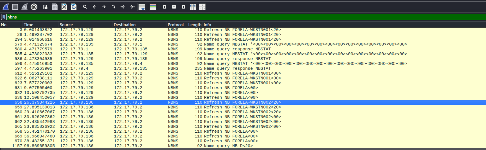
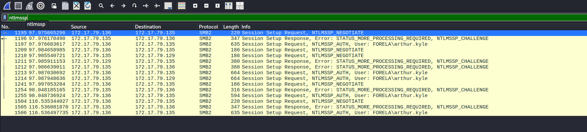
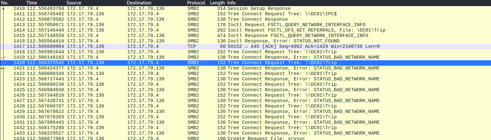
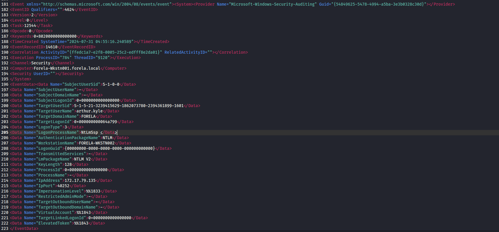
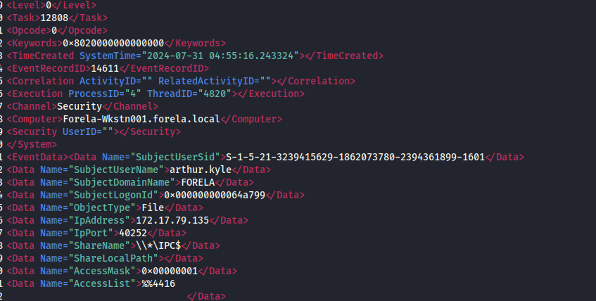

# HackTheBox - Reaper: Network Forensics and SIEM Alert Investigation

## Challenge Synopsis

Our Security Information and Event Management (SIEM) system triggered a critical alert regarding a suspicious logon event that requires immediate investigation. The alert indicated a mismatch between the IP address and the source workstation name during an authentication attempt. As a security analyst, we are tasked with analyzing the provided network capture and Windows event logs from the incident timeframe to correlate evidence and provide a comprehensive report to the SOC Manager.

## Investigation Methodology

This forensic analysis involves examining network traffic patterns, NTLM authentication flows, and Windows security event logs to reconstruct the attack timeline and identify the compromised credentials.

## Network Traffic Analysis

### Workstation IP Address Discovery

#### Forela-Wkstn001 Identification
Upon opening the network capture, we immediately observed workstation refresh activity. By analyzing the initial network communications, we identified that **Forela-Wkstn001** operates from IP address **172.17.79.129**. This information was obtained by examining the source addresses of the workstation's network refresh packets.

#### Forela-Wkstn002 Identification
To locate the second workstation, we applied a filter for the **NetBIOS Name Service (NBNS)** protocol, which is commonly used for workstation name resolution and registration in Windows networks. Through this analysis, we discovered that **Forela-Wkstn002** is associated with IP address **172.17.79.136**.

### Authentication Attack Analysis

#### NTLM Protocol Investigation
We filtered the network capture for **NTLMSSP (NT LAN Manager Security Support Provider)** traffic to examine authentication attempts. NTLM is Microsoft's proprietary authentication protocol that provides authentication, integrity, and confidentiality services in Windows environments. It operates through a challenge-response mechanism between clients and servers.

#### Compromised Credentials Discovery
Through the NTLM traffic analysis, we identified that the attacker successfully obtained and attempted to use the credentials for username **arthur.kyle**. This represents a clear case of credential theft and unauthorized authentication attempts.

#### Attacker IP Address Identification
The NTLM authentication packets revealed communication between two distinct IP addresses:
- **Attacker IP**: 172.17.79.135
- **Target Workstation**: 172.17.79.136 (Forela-Wkstn002)

This communication pattern confirms that the attacker operated from IP address 172.17.79.135 while targeting the legitimate workstation.

### File Share Access Attempts

#### SMB Protocol Analysis
Further investigation revealed that the attacker attempted to access a network share. Using **Server Message Block version 2 (SMB2)** protocol analysis, we identified that the attacker requested access to the directory path **\\\\DC01\\trip**. SMB2 represents the enhanced version of the original Windows file-sharing protocol, providing improved performance and security features.

## Windows Event Log Analysis

### Event Log Processing Challenges
Working within a Linux environment presented challenges for analyzing Windows Event Log (.evtx) files, as native Windows tools are not available. To overcome this limitation, we utilized the **python-evtx** tool available at [https://github.com/williballenthin/python-evtx](https://github.com/williballenthin/python-evtx), which converts Windows event logs to XML format for cross-platform analysis.

### Successful Logon Event Discovery

#### Event ID 4624 Analysis
We focused our search on **Event ID 4624**, which corresponds to "An account was successfully logged on" events in Windows security logs. This event type provides crucial information about successful authentication attempts, including source IP addresses, usernames, and logon sessions.

#### Attack Timeline Reconstruction
Through the event log analysis, we successfully identified the malicious logon event with the following key details:

- **Compromised Username**: arthur.kyle
- **Source IP Address**: 172.17.79.135 (confirmed attacker IP)
- **Source Port**: 40252
- **Logon ID**: 0x64A799
- **Target Workstation**: Detailed workstation information and IP address
- **Timestamp**: Complete date and time of the security incident

#### Network Share Access Evidence
The event logs also revealed the specific network share accessed during the authentication process: **\\\\\*\\IPC\$**. The IPC$ (Inter-Process Communication) share is a special administrative share used for remote administration and inter-process communication in Windows environments.

## Key Findings Summary

### Attack Methodology
The investigation confirms a sophisticated attack involving credential theft, NTLM authentication bypass, and unauthorized network resource access. The attacker successfully impersonated a legitimate user while operating from a different IP address, triggering the SIEM alert due to the IP/workstation name mismatch.

## Conclusion

This forensic analysis successfully correlates network traffic evidence with Windows security event logs to provide a comprehensive understanding of the security incident. The investigation demonstrates the importance of multi-layered security monitoring and the value of correlating different data sources to detect and analyze sophisticated authentication attacks.

The evidence clearly shows an active compromise involving stolen credentials and unauthorized network access, requiring immediate incident response procedures and credential reset for the affected user account.