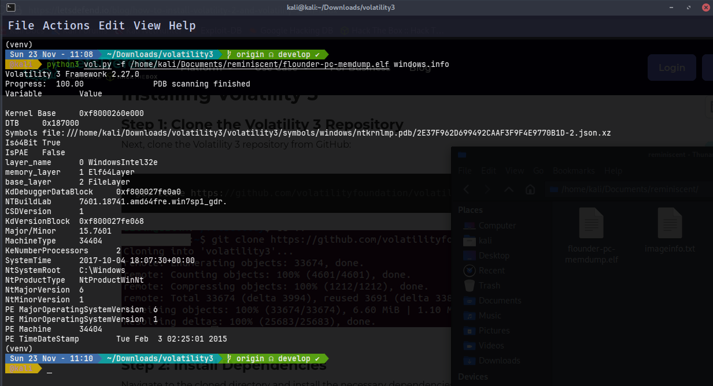
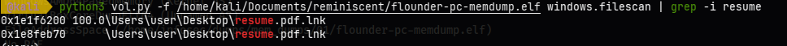
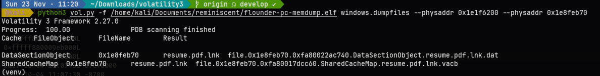
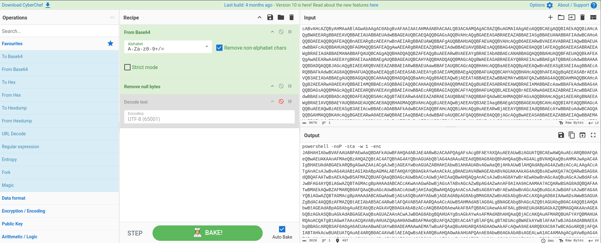
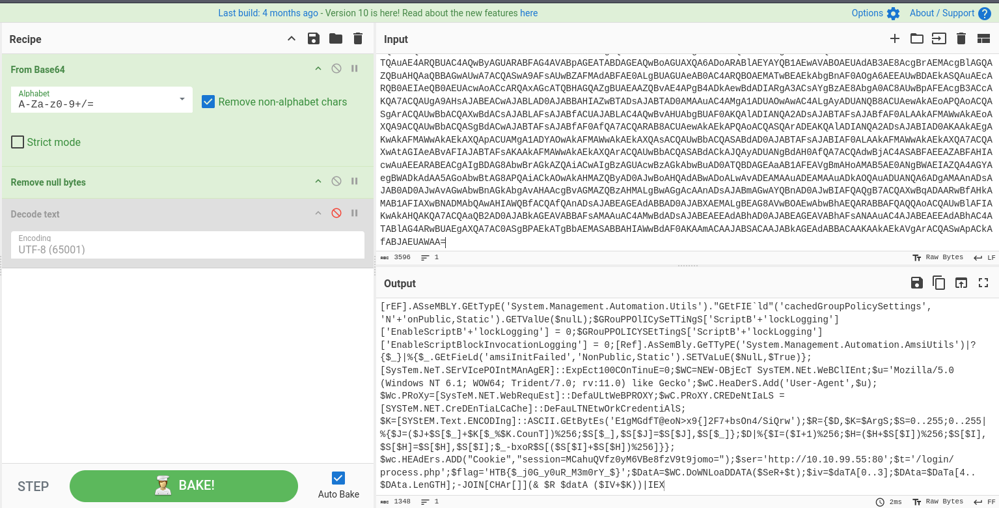

# Reminiscent - Memory Forensics Challenge

### Challenge Description

We are provided with a Windows memory dump file that requires forensic analysis to uncover hidden evidence. The investigation focuses on extracting and analyzing a suspicious file from the memory image to recover the flag.

---

## Memory Dump Analysis

### System Information Gathering

The first step in any memory forensics investigation is to identify the operating system and system configuration. We use Volatility 3's `windows.info` plugin to extract system information from the memory dump:

```bash
python3 vol.py -f /home/kali/Documents/reminiscent/flounder-pc-memdump.elf windows.info
```



### System Profile Results

```
Detected Profile: Windows 7 SP1 x64 (64-bit)
```

#### Key System Information

The output provides critical information about the compromised system:

- **Operating System:** Windows 7
  - `NtMajorVersion: 6` and `NtMinorVersion: 1` = Windows 7
- **Build Number:** 7601.18741 (Windows 7 Service Pack 1)
- **Architecture:** PE Machine 34404 = AMD64 (64-bit architecture)
- **Service Pack:** CSDVersion 1 = Service Pack 1
- **System Time:** 2017-10-04 18:07:30 (timestamp when the memory dump was captured)

This information is crucial as it:
1. Confirms the correct Volatility profile to use for analysis
2. Provides temporal context for the investigation
3. Identifies the system architecture for plugin compatibility

---

## Email and Artifact Discovery

### Initial Lead

During the initial investigation, evidence was discovered in the system's email data pointing to a file named `resume.zip`. The email contained a hyperlink redirecting to a suspicious URL:

```
http://10.10.99.55:8080/resume.zip
```

**Indicators of Compromise:**
- Internal IP address (10.10.99.55) suggesting possible lateral movement or internal threat
- Non-standard port (8080) often used for proxy servers or web applications
- Generic filename (`resume.zip`) commonly used in phishing campaigns

### Investigation Strategy

Given that the target file is named `resume` and was likely in the process of being downloaded or extracted, we need to:
1. Scan the memory dump for files matching this pattern
2. Locate the file's physical memory address
3. Extract the file for analysis

---

## File System Scanning

### Using Volatility's FileScan Plugin

The `windows.filescan` plugin scans the memory dump for file objects, providing information about files that were open, recently accessed, or cached in memory at the time of capture.

```bash
python3 vol.py -f /home/kali/Documents/reminiscent/flounder-pc-memdump.elf windows.filescan | grep -i resume
```



**Command Breakdown:**
- `windows.filescan`: Volatility plugin that enumerates file objects from memory
- `| grep -i resume`: Filters output for files containing "resume" (case-insensitive)

## File Extraction

### Extracting Files from Memory

Using the physical addresses discovered in the filescan results, we can extract the actual file contents from memory using Volatility's `windows.dumpfiles` plugin:

```bash
python3 vol.py -f /home/kali/Documents/reminiscent/flounder-pc-memdump.elf windows.dumpfiles --physaddr 0x3fa3f070 --physaddr 0x3fb2e0a0
```

**Command Parameters:**
- `windows.dumpfiles`: Plugin for extracting cached files from memory
- `--physaddr 0x<addr1>`: Physical memory address of the first file instance
- `--physaddr 0x<addr2>`: Physical memory address of the second file instance

**Note:** Replace `0x<addr1>` and `0x<addr2>` with the actual physical addresses found in your filescan output.



### Extraction Output

These extracted files contain the raw data from memory and require further analysis.

---

## Decoding and Analysis

### Initial File Analysis

Upon examining the extracted files, the contents appear to be encoded data rather than a standard ZIP archive. The data is not readable in its current form and does not match the expected ZIP file signature (`PK\x03\x04`).

### First Decoding Layer: Base64

The encoded data exhibits characteristics typical of Base64 encoding:
- Contains only alphanumeric characters, `+`, `/`, and `=` padding
- Length is a multiple of 4 (standard Base64 property)

---

## Final Decoding Steps

After identifying the data as Base64, we extracted the encoded content and proceeded with decoding. To simplify the process, we used **CyberChef**, which allowed me to quickly test multiple decoding layers.



The data required **two successive Base64 decodes** to produce a valid output. After the second decode, the contents were correctly reconstructed revealing the **flag** for the challenge.

