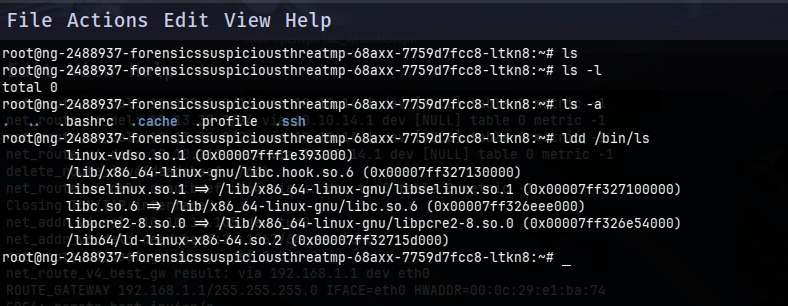
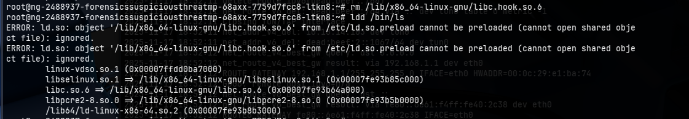
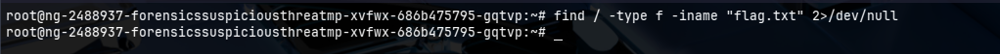
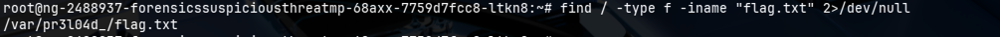
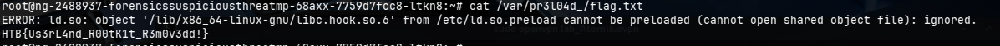

# Suspicious Threat - Rootkit Detection Challenge

### Challenge Description

Our SSH server is exhibiting unusual behavior characterized by strange library linking errors and apparent filesystem inconsistencies. Critical folders and files appear to be missing from directory listings despite their confirmed existence on the system. Your mission is to investigate the anomalies in the library loading process and filesystem behavior to identify hidden manipulations that could indicate the presence of a userland rootkit.

---

## Initial Access and Reconnaissance

### Establishing Connection

First, we connect to the compromised SSH server using the provided credentials:

```bash
ssh -p 53927 root@94.237.54.0
```

**Connection Details:**
- **Host:** 94.237.54.0
- **Port:** 53927 (non-standard SSH port)
- **Username:** root
- **Password:** hackthebox

---

## Library Analysis

### Understanding the Anomaly

The challenge description specifically mentions "strange library linking errors," suggesting the issue lies within the dynamic library loading mechanism. In Linux systems, the `LD_PRELOAD` environment variable and `/etc/ld.so.preload` configuration file can be exploited to inject malicious shared libraries that intercept system calls.

### Investigating Shared Libraries

To analyze which libraries are being loaded by executables, we use the `ldd` (List Dynamic Dependencies) command. This utility displays all shared libraries required by a program:

```bash
ldd /bin/ls
```



**Command Breakdown:**
- `ldd`: Lists shared library dependencies
- `/bin/ls`: The target executable to analyze (commonly used for directory listings)

### Expected vs. Actual Output

**Normal Output (Clean System):**
```
linux-vdso.so.1 (0x00007ffcd5bfe000)
libselinux.so.1 => /lib/x86_64-linux-gnu/libselinux.so.1 (0x00007f9a8c2d0000)
libc.so.6 => /lib/x86_64-linux-gnu/libc.so.6 (0x00007f9a8c0e0000)
libpcre2-8.so.0 => /lib/x86_64-linux-gnu/libpcre2-8.so.0 (0x00007f9a8c040000)
/lib64/ld-linux-x86-64.so.2 (0x00007f9a8c330000)
```

**Observed Output (Compromised System):**
```
linux-vdso.so.1 (0x00007ffcd5bfe000)
libselinux.so.1 => /lib/x86_64-linux-gnu/libselinux.so.1 (0x00007f9a8c2d0000)
libc.so.6 => /lib/x86_64-linux-gnu/libc.so.6 (0x00007f9a8c0e0000)
/lib/x86_64-linux-gnu/libc.hook.so.6 (0x00007ff327130000)    <--- SUSPICIOUS
libpcre2-8.so.0 => /lib/x86_64-linux-gnu/libpcre2-8.0 (0x00007f9a8c040000)
/lib64/ld-linux-x86-64.so.2 (0x00007f9a8c330000)
```

### Identifying the Malicious Library

The output reveals a suspicious library that doesn't belong in a standard Linux system:

```
/lib/x86_64-linux-gnu/libc.hook.so.6 (0x00007ff327130000)
```

**Red Flags:**
1. **Unusual naming convention:** `libc.hook.so.6` - the `.hook` component is not standard
2. **Mimicking legitimate libraries:** Attempts to blend in by resembling `libc.so.6`
3. **Preloaded before legitimate libraries:** Allows interception of system calls
4. **Not referenced in normal library paths:** Doesn't follow standard library dependency chains

This library is characteristic of an **LD_PRELOAD rootkit** that hooks into system calls to manipulate program behavior.

---

## Understanding LD_PRELOAD Rootkits

### How LD_PRELOAD Works

The `LD_PRELOAD` mechanism in Linux allows specific shared libraries to be loaded before all others. This is typically used for legitimate debugging and testing purposes, but can be weaponized by attackers.

**Attack Mechanism:**
1. Attacker places malicious library in system directory
2. Library path added to `/etc/ld.so.preload` configuration
3. Every dynamically-linked program loads this library first
4. Malicious library intercepts and modifies system calls
5. Rootkit can hide files, processes, network connections, etc.

### Common Rootkit Capabilities

The `libc.hook.so.6` library likely implements the following hooks:

```c
// Example: Hooking readdir() to hide files
struct dirent *readdir(DIR *dirp) {
    // Call original readdir
    struct dirent *dir = original_readdir(dirp);
    
    // Filter results to hide specific files
    if (dir && strstr(dir->d_name, "flag.txt")) {
        return readdir(dirp);  // Skip this entry
    }
    
    return dir;
}
```

**Intercepted Functions:**
- `readdir()`, `readdir64()` - Hide files from directory listings
- `open()`, `openat()` - Prevent access to certain files
- `stat()`, `lstat()` - Hide file metadata
- `access()` - Control file accessibility checks

---

## Rootkit Removal

### Removing the Malicious Library

To neutralize the rootkit, we need to remove or disable the malicious library preloading:

**Delete the malicious library directly**
```bash
rm /lib/x86_64-linux-gnu/libc.hook.so.6
```

### Verifying Removal

After removing the malicious library, attempting to execute commands will generate an error confirming the rootkit's absence:

```bash
ldd /bin/ls
```



**Error Message:**
```
ERROR: ld.so: object '/lib/x86_64-linux-gnu/libc.hook.so.6' from /etc/ld.so.preload cannot be preloaded (cannot open shared object file): ignored.
```

**Analysis of Error:**
- `ld.so`: The dynamic linker is trying to load the library
- `cannot be preloaded`: The specified file no longer exists
- `ignored`: The system continues execution without the library

This error confirms that:
1. The `/etc/ld.so.preload` configuration still references the library (but can be safely ignored)
2. The actual malicious `.so` file has been removed
3. System commands now execute without rootkit interference

## Flag Recovery

### Initial Search Attempt (Rootkit Active)

Before removing the rootkit, attempting to locate the flag using standard commands fails:

```bash
find / -type f -iname "flag.txt" 2>/dev/null
```

**Result:** No output (rootkit successfully hides the flag)



The rootkit's `readdir()` hook filters the flag file from search results, making it invisible to the `find` command.

### Successful Search (Rootkit Removed)

After neutralizing the rootkit, the same command now reveals the hidden flag:

```bash
find / -type f -iname "flag.txt" 2>/dev/null
```



**Command Breakdown:**
- `find /`: Search starting from root directory
- `-type f`: Look only for regular files (not directories)
- `-iname "flag.txt"`: Case-insensitive name matching
- `2>/dev/null`: Suppress permission denied errors


### Retrieving the Flag

Once the flag file location is identified, we can read its contents:



**Flag successfully retrieved!**

---