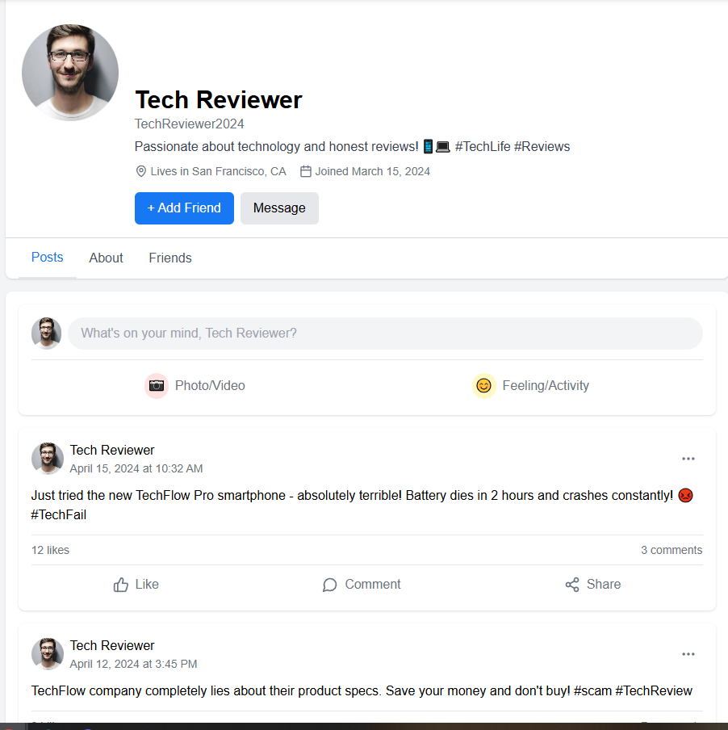
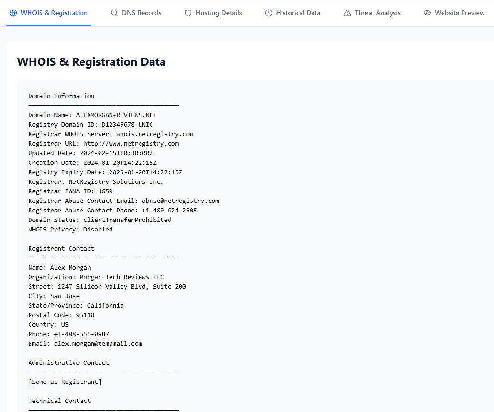
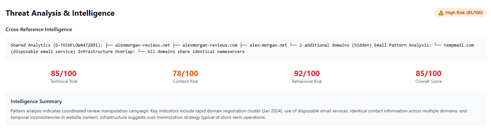

# OSINT Challenges - Quick Wins

This writeup covers two quick OSINT (Open Source Intelligence) challenges from HackTheBox that focus on social media investigation and domain infrastructure analysis.

---

## Challenge 1: Social Media Profile Investigation

### Scenario

**Mission Briefing**: We've identified a potentially fraudulent social media profile that may be part of a larger astroturfing campaign. The profile "TechReviewer2024" on SocialConnect shows several red flags indicating artificial creation and coordinated inauthentic behavior. Your mission is to investigate this profile thoroughly and extract any contact information that could lead to the real person behind this fake account.

### Objective

Investigate the "TechReviewer2024" profile and extract identifying information.

### Solution

#### Step 1: Profile Analysis

We began by conducting a thorough examination of the TechReviewer2024 social media profile on the SocialConnect platform. The profile displayed several indicators of fraudulent activity, including artificial creation patterns and coordinated inauthentic behavior.

#### Step 2: Email Discovery

Through careful analysis of the profile information, we successfully located an email address associated with the account. This email address became our primary lead for attribution.

#### Step 3: Identity Attribution

Using the discovered email address, we were able to identify the real name and surname of the person operating the fake account. This confirmed that the profile was indeed fraudulent and provided concrete attribution to a real individual behind the operation.

---

## Challenge 2: Domain Infrastructure Investigation

### Scenario

Following the discovery of the suspicious social media profile "TechReviewer2024", investigators have uncovered a review manipulation campaign targeting TechFlow. The domain "alexmorgan-reviews.net" appears to be central to this operation. Use DomainScope to investigate this domain and identify the key identifier linking it to the broader campaign infrastructure.

### Objective

Investigate the domain "alexmorgan-reviews.net" and extract infrastructure details to understand the review manipulation campaign.

### Solution

#### Step 1: WHOIS Data Collection

We utilized DomainScope to perform comprehensive WHOIS lookups on "alexmorgan-reviews.net". We had to answer multiple questions where the answers were found in the WHOIS response. The information we retrieved included:

- **Email address**: Registrant contact email
- **Phone number**: Contact number associated with the domain
- **Company name**: Organization listed in registration records
- **City**: Geographic location of the registrant
- **Domain transfer status**: Current transfer lock status

This WHOIS data provided crucial attribution information linking the domain to specific individuals or organizations.

#### Step 2: DNS Record Analysis

We performed DNS enumeration on the domain to understand the technical infrastructure. Through DNS record analysis, we discovered that the domain is utilizing **GitHub Pages** for hosting.

**Key Finding**: We identified the number of GitHub Pages IP addresses configured in the DNS records. This revealed that the threat actor was using free, legitimate hosting platforms to minimize costs and evade detection.

#### Step 3: Identifying the Target Company

To identify the company responsible for or targeted by this attack, we analyzed reviews on the website associated with the fraudulent domain. We found a very bad review from a specific company in the website review section of the tech review platform. This review was also mentioned in the scenario and helped us identify the primary target of the review manipulation campaign.

#### Step 4: Threat Intelligence Analysis

Using threat intelligence analysis, we investigated the mail service infrastructure. By examining the DNS records and performing threat analysis, we successfully identified the **mail service provider** that the attacker used to conduct their operations against the website.

This finding was significant because it revealed the communication infrastructure used by the threat actor and provided additional attribution data points.

---

## Conclusion

These two quick OSINT challenges demonstrated fundamental investigation techniques:

**Challenge 1** focused on social media intelligence (SOCMINT), showing how email addresses discovered in profiles can lead to real identity attribution.

**Challenge 2** expanded into technical infrastructure analysis, combining WHOIS lookups, DNS enumeration, content analysis, and threat intelligence to map out a complete malicious operation.

## Tools and Techniques Used

- **Social Media Analysis**: Profile metadata extraction
- **DomainScope**: WHOIS and DNS investigation
- **DNS Enumeration**: Infrastructure mapping
- **Content Analysis**: Review pattern identification
- **Threat Intelligence**: Email service identification

These fundamental OSINT skills form the foundation for more complex investigations in cybersecurity and threat intelligence operations.