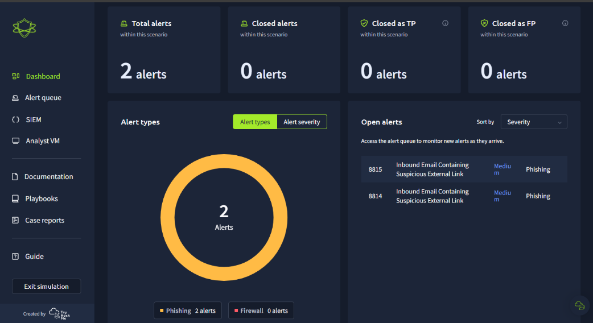

# **SOC Simulator - Write-up**

&nbsp;

## Scenario Overview

The task involves analyzing several security incidents including suspicious emails and outbound web connections. Using tools like **Splunk**, **TryDetectThis**, and **Firewall Logs**, we determine whether alerts are **true** or **false positives**.

&nbsp;

## 🕵️‍♂️ Investigation 1: Suspicious Email with Malicious URL
&nbsp;
- **Observation**: A URL in the email seemed suspicious.
- **Splunk Results**: Sender is not previously seen in the logs — **unknown**.
- **TryDetectThis**: URL flagged as **malicious**.
- **Firewall**: Allowed access to the malicious website.

&nbsp;  

&nbsp;

### Verdict: ✅ **True Positive**
> The URL is malicious, and the sender is unknown. The user accessed the link, putting the company at risk.
    
&nbsp;

## 🌐 Investigation 2: Suspicious Outbound Connection

&nbsp;

- **Analysis**:
  - URL was blocked.
  - Firewall recognized the website and prevented access.

&nbsp;

### Verdict: ✅ **True Positive**
> Malicious site was correctly blocked by the firewall. No escalation needed, but incident is valid.

&nbsp;

## 📧 Investigation 3 & 4: Emails with Internal Links

&nbsp;

- **Observation**: Sender and recipient share the **@THM** domain.
- **Context**: Internal communication asking for access configuration.
- **TryDetectThis**: Links marked **clean**.

&nbsp;

### Verdicts: ❌ **False Positives** (2 incidents)
> Normal internal communication. URLs not flagged as malicious.

&nbsp;

## 💻 Investigation 5: User Access Attempt Traced to Email

&nbsp;

- **Observation**: The user tried accessing a previously blocked malicious website.
- **Root Cause**: Originated from the earlier email.
- **Sender**: Already blacklisted.

&nbsp;

### Verdict: ✅ **True Positive**
> Attack confirmed. Origin tracked. Sender added to blacklist.

&nbsp;

## 🧠 Lessons Learned

&nbsp;

- Combine multiple tools (**Splunk**, **Firewall**, **TryDetectThis**) for reliable triage.
- Sender reputation is crucial in email-based attacks.
- Internal domain doesn't always mean internal origin — still requires verification.
- Firewall blocks help contain threats but **don't replace investigation**.

&nbsp;

## 🧰 Tools Used

&nbsp;

- Splunk
- TryDetectThis
- Firewall Logs

&nbsp;

## ✅ Final Thoughts

&nbsp;

This simulation highlights essential SOC workflows:
- Validate incidents via cross-referencing.
- Differentiate between true and false positives.
- Document reasons for escalation or not.

&nbsp;

## 🏁 Verdict Summary

&nbsp;

| Incident | Description                        | Verdict        |
|----------|------------------------------------|----------------|
| #1       | Suspicious URL                     | ✅ True Positive |
| #2       | Outbound connection blocked        | ✅ True Positive |
| #3–4     | Internal emails (THM domain)       | ❌ False Positive |
| #5       | User access due to malicious email | ✅ True Positive |
