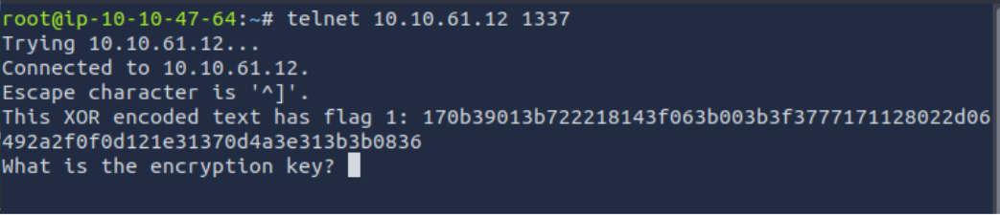
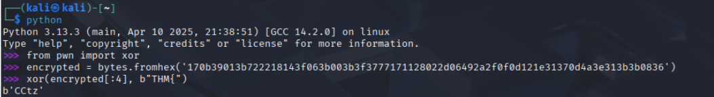
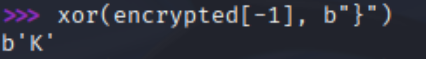
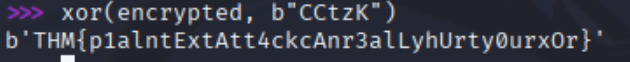

# W1seGuy – TryHackMe Write-Up  
**Room:** [W1seGuy](https://tryhackme.com/room/w1seguy)

---

## 🧠 Initial Analysis

We’re presented with the following Python code that sets up a TCP server:

```python
import random 
import socketserver 
import socket, os 
import string 

flag = open('flag.txt','r').read().strip() 

def send_message(server, message): 
    enc = message.encode() 
    server.send(enc) 

def setup(server, key): 
    flag = 'THM{thisisafakeflag}' 
    xored = "" 
    for i in range(0, len(flag)): 
        xored += chr(ord(flag[i]) ^ ord(key[i % len(key)])) 
    hex_encoded = xored.encode().hex() 
    return hex_encoded 

def start(server): 
    res = ''.join(random.choices(string.ascii_letters + string.digits, k=5)) 
    key = str(res) 
    hex_encoded = setup(server, key) 
    send_message(server, "This XOR encoded text has flag 1: " + hex_encoded + "\n") 
    
    send_message(server, "What is the encryption key? ") 
    key_answer = server.recv(4096).decode().strip() 
    try: 
        if key_answer == key: 
            send_message(server, "Congrats! That is the correct key! Here is flag 2: " + flag + "\n") 
            server.close() 
        else: 
            send_message(server, 'Close but no cigar' + "\n") 
            server.close() 
    except: 
        send_message(server, "Something went wrong. Please try again. :)\n") 
        server.close() 

class RequestHandler(socketserver.BaseRequestHandler): 
    def handle(self): 
        start(self.request) 

if __name__ == '__main__': 
    socketserver.ThreadingTCPServer.allow_reuse_address = True 
    server = socketserver.ThreadingTCPServer(('0.0.0.0', 1337), RequestHandler) 
    server.serve_forever()
```

From the code, we can see that the program sets up a TCP server and creates a random 5-character long string that is used to XOR the flag. If the user manages to retrieve the correct key, they are rewarded with the second flag.

---

## 🛠️ Interacting with the Service

To begin, we use `telnet` to interact with the running service.



Once connected, we receive an XOR-encoded version of the flag.

---

## 🔓 Exploiting the XOR Cipher

Since the flag starts with `THM{`, we can leverage this known plaintext to perform a plaintext attack on the XOR cipher.

By XORing the first 4 bytes of the encoded text with `T`, `H`, `M`, and `{`, we can recover the corresponding bytes of the key.

To automate this, I wrote a small Python script that performs this operation and reveals the key.



As a result, we obtain part of the key: `CCtz`.

Additionally, knowing that flags typically end with a closing curly brace `}`, we can XOR the corresponding byte to extract more of the key.



Combining both parts, we reconstruct the full key as: `CCtz}`.


Using this key in the TCP service grants us access to the second flag.

---

## 🔍 Recovering the First Flag

As for the first flag, it can be recovered by XORing the hex-encoded string given by the service with the derived key. Repeating the XOR operation over the ciphertext reveals the original plaintext flag.



And there it is — the first flag successfully decoded.

---

## 📝 Conclusion

To conclude, this challenge was a bit difficult for me initially, as I’ve only spent a single day learning about this type of encryption. It was also my first time attempting to decrypt a custom XOR-based encryption scheme.

However, despite the initial confusion, it turned out to be a cool learning experience and introduced me to new concepts and practical applications of XOR encryption.
